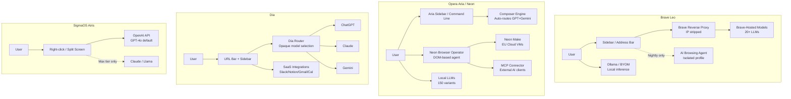

# AI Browser Features Comparison

**Brave Leo vs Opera Aria/Neon vs Dia vs SigmaOS Airis**  
*Compiled 2026-04-08 · Feynman research pipeline*

---

## Executive Summary

Four browsers are competing to define "AI-native browsing," but they occupy very different positions:

- **Brave Leo** leads on **privacy** (zero retention, all models self-hosted, no account required) and **model diversity** (20+ models, BYOM). Agent automation exists only in Nightly. No MCP support yet.
- **Opera Aria/Neon** leads on **agent automation** (Browser Operator, cloud agents) and is the **only browser with shipped MCP support** (Neon MCP Connector, March 2026). Two-product strategy (free Aria + $19.90 Neon) splits capabilities sharply.
- **Dia** excels at **cross-tool context** (Slack/Notion/Gmail/Calendar integrations) and **UX polish** (inline text editing, Skills gallery) but is deliberately **non-agentic** (no clicks, no form-filling) and has **no MCP or developer API**. macOS Apple Silicon only.
- **SigmaOS Airis** remains an **Alpha-stage product** with strong single-page context UX but critical gaps: macOS-only, no MCP, no developer API, unclear shipped-vs-announced boundary for agentic features.

**No browser has a public developer API for its AI features.** This is the largest shared gap across the category.

---

## Feature Coverage Heatmap

*Scores reflect shipped feature depth on a 0–10 scale, weighted by evidence quality. See scoring rationale per dimension below.*

---

## Comparison Matrix

### 1. AI Model Access & Selection

| Attribute | Brave Leo | Opera Aria/Neon | Dia | SigmaOS Airis |
|---|---|---|---|---|
| Models available | 20+ (6 free, 14+ premium) | GPT + Gemini (Aria); GPT-5.1, Gemini 3 Pro (Neon); 150 local variants | ChatGPT, Claude, Gemini (opaque routing) | GPT-4o (Pro); Llama, Claude (Max) |
| User model selection | ✅ Manual + auto mode | ❌ Aria: auto-routed · ✅ Neon: selectable | ❌ No selection | ❌ Free/Pro · ✅ Max ($30) only |
| On-device / local | BYOM via Ollama (desktop ≥1.69) | 150 LLMs (Developer/Neon channels) | ❌ Cloud only | ❌ Cloud only |
| BYOM / custom models | ✅ Ollama + remote API keys | ❌ Not supported | ❌ Not supported | ❌ Not supported |
| **Confidence** | ★★★ | ★★★ | ★★ | ★★ |

**Key claim**: Brave self-hosts all models since June 30, 2025 — no data reaches Anthropic/Meta/etc. [Brave Help Center](https://support.brave.com/hc/en-us/articles/26727364100493)  
**Key claim**: Dia routes between ChatGPT/Claude/Gemini with no user visibility into which model handles a given query. [TidBITS, Aug 2025](https://tidbits.com/2025/08/08/dia-ai-browser-introduces-20-monthly-pro-plan-with-unlimited-chat/)

---

### 2. Agent Automation Capabilities

| Attribute | Brave Leo | Opera Aria/Neon | Dia | SigmaOS Airis |
|---|---|---|---|---|
| Autonomous navigation | ⚠️ Nightly only (flag-gated) | ✅ Browser Operator (Neon) | ❌ Not available | ⚠️ Demoed, unclear if shipped |
| Form filling | ⚠️ Roadmap | ✅ Neon (user types sensitive data) | ❌ Not available | ⚠️ Claimed by 3rd-party review |
| Multi-step workflows | ⚠️ Nightly only | ✅ Neon Do + Make modes | ❌ Not available | ⚠️ Uncertain |
| Cloud agents | ❌ | ✅ Neon Make (EU servers) | ❌ | ❌ |
| Prompt/skill macros | ✅ Skills (`/slash` commands) | ✅ Command Line shortcuts | ✅ Skills gallery + community | ❌ |
| Third-party read integrations | ❌ Future | ❌ | ✅ Slack, Notion, Gmail, Calendar, Amplitude | ❌ |
| **Confidence** | ★★★ | ★★★ | ★★★ | ★ |

**Agreement**: Brave and Opera both pursue DOM-based agentic browsing with security sandboxing. Both use alignment-checker / prompt-analysis second-model review.  
**Disagreement**: Dia deliberately avoids agentic DOM automation, treating it as a security risk. Opera and Brave treat it as a competitive advantage.  
**Uncertainty**: SigmaOS Airis agentic browsing was demoed (early 2024) and claimed shipped by a 2026 third-party review, but no official changelog confirms it. Airis remains labeled "Alpha."

---

### 3. Privacy Model

| Attribute | Brave Leo | Opera Aria/Neon | Dia | SigmaOS Airis |
|---|---|---|---|---|
| Data retention | **Zero** (discarded after response) | 30 days (encrypted, Opera servers) | "Brief" (unspecified); 30d if opted into improvement | Indefinite until user requests deletion |
| IP anonymization | ✅ Reverse proxy strips IPs | ❌ Not documented | ❌ Not documented | ❌ Not documented |
| Account required | ❌ Free: no account | ❌ Aria: no account (since Sept 2024) | ✅ Required for AI | ✅ Required |
| Training on user data | ❌ Never | ❌ Never | ❌ Contractually prohibited | ❌ Not stated (privacy policy predates AI) |
| Third-party data sharing | ❌ None (all self-hosted) | OpenAI: 30d anonymized; Google: ≤24h | Partners receive queries (contractual limits) | ⚠️ Not disclosed |
| TEE / verifiable privacy | ⚠️ Nightly only (DeepSeek V3.1) | ❌ | ❌ | ❌ |
| On-device storage | ✅ Chat history local-only | ❌ Chat history on Opera servers | ✅ Local-first | ✅ Local by default |
| **Confidence** | ★★★ | ★★★ | ★★ | ★ |

**Strongest privacy**: Brave Leo — zero retention, no account, IP stripping, all models self-hosted, unlinkable subscription tokens. No other browser matches this combination.  
**Weakest privacy signal**: SigmaOS — privacy policy predates Airis, no AI-specific data handling disclosed. Material gap.  
**Caveat**: Dia's Atlassian acquisition ($610M, [CNBC](https://www.cnbc.com/2025/09/04/atlassian-the-browser-company-deal.html); $932M at closing per [Brisbane Times](https://www.brisbanetimes.com.au/link/follow-20170101-p5mscs)) creates unaddressed data governance questions.

---

### 4. Pricing & Tiers

| Browser | Free | Paid Tier(s) | Annual Option | Enterprise |
|---|---|---|---|---|
| Brave Leo | ✅ No account, 6 models | $14.99/mo ($149.99/yr), 10 devices | ✅ | ❌ Roadmap |
| Opera Aria/Neon | ✅ No account (Aria) | $19.90/mo (Neon) | ❌ | ❌ |
| Dia | ✅ Rate-limited + 14-day Pro trial | $20/mo (Pro) | ❌ | ❌ |
| SigmaOS | ✅ Limited Airis | $20/mo (Pro) · $30/mo (Max) | ❌ | ❌ |

**Best value**: Brave Leo offers the most generous free tier (6 models, no account) and cheapest premium ($14.99/mo covering 10 devices).  
**No enterprise tier exists for any of these browsers** as of April 2026.

---

### 5. Platform Support

| Platform | Brave Leo | Opera Aria/Neon | Dia | SigmaOS Airis |
|---|---|---|---|---|
| Windows | ✅ | ✅ | ⏳ Waitlist | ❌ |
| macOS | ✅ | ✅ | ✅ Apple Silicon only | ✅ |
| Linux | ✅ | ✅ | ❌ | ❌ |
| Android | ✅ | ✅ | ❌ | ❌ |
| iOS | ✅ | ✅ | ❌ | ❌ |
| Cross-device sync | ❌ Not implemented | ✅ Via Opera Account | ⚠️ Partial (preferences) | ⚠️ Opt-in Mac-to-Mac |

**Gap**: Dia and SigmaOS are macOS-only, severely limiting addressable market. Brave has the widest platform coverage but lacks AI chat sync across devices ([GitHub #47308](https://github.com/brave/brave-browser/issues/47308)).

---

### 6. User Experience Quality

| Attribute | Brave Leo | Opera Aria/Neon | Dia | SigmaOS Airis |
|---|---|---|---|---|
| Primary UI surface | Sidebar + full-page + address bar | Sidebar + Command Line (`Ctrl+/`) | URL bar + right sidebar + inline | Right-click + split-screen (`A`) |
| Inline text editing | ❌ | ❌ | ✅ Select → edit → Insert | ✅ In-page animated rewriting |
| Keyboard-centric | Moderate | ✅ Command Line | Moderate | ✅ Single-key modal shortcuts |
| Mobile AI UX | ✅ Voice input | ✅ AI button | ❌ No mobile | ❌ No mobile |
| Discoverability | High (toolbar icon + address bar) | High (multiple entry points) | High (always-visible sidebar) | Medium (right-click + keyboard) |
| **Confidence** | ★★★ | ★★ | ★★ | ★★ |

**Agreement**: All four browsers integrate AI into browser chrome rather than treating it as an extension. Sidebar is the dominant pattern.  
**Dia friction**: AI triggers in the URL bar when users intend a regular Google search — reported as a pain point.

---

### 7. MCP / Extension Integration

| Attribute | Brave Leo | Opera Aria/Neon | Dia | SigmaOS Airis |
|---|---|---|---|---|
| MCP server | ❌ (Brave Search MCP is separate) | ✅ **Shipped** (Neon, Mar 31 2026) | ❌ | ❌ |
| MCP client | ❌ Future | ❌ | ❌ | ❌ |
| Extension AI hooks | ❌ Future | ❌ No `opr.ai.*` API | ❌ | ❌ |
| Extension ecosystem | Chrome Web Store | Chrome Web Store | Chrome Web Store (limited) | Chrome Web Store (WebKit caveats) |
| Plugin/tool framework | ❌ Future | MCP Connector (Neon-only) | Skills (prompt-only, no code) | ❌ |
| **Confidence** | ★★★ | ★★★ | ★★★ | ★★ |

**Critical finding**: Opera Neon is the **only browser with shipped MCP support**. It acts as an MCP server, letting Claude, ChatGPT, n8n, and other MCP clients control the browser. Read tools enabled by default; write tools (clicks, form fill, navigation) disabled by default, user must opt in. ([Opera press release](https://press.opera.com/2026/03/31/opera-neon-adds-mcp-connector/))

**No browser exposes AI capabilities to extensions** via a dedicated API namespace. This is the biggest shared gap for the developer ecosystem.

---

### 8. Context Handling

| Context Type | Brave Leo | Opera Aria/Neon | Dia | SigmaOS Airis |
|---|---|---|---|---|
| Current page | ✅ | ✅ | ✅ | ✅ |
| Multiple tabs | ✅ Multi Tab Context (≥1.81) | ✅ Tab Islands | ✅ @mention tabs | ❌ Not confirmed |
| PDF | ✅ | ✅ (Command Line) | ✅ Attachments | ❌ Not confirmed |
| Files (upload) | ✅ Images, screenshots | ✅ 3 files (incl. video/audio) | ✅ Attachments | ❌ Not confirmed |
| YouTube transcripts | ✅ | ❌ | ✅ Built-in skill | ❌ |
| Browsing history | ⚠️ In development | ⚠️ Neon MCP opt-in only | ✅ Opt-in | ❌ |
| Persistent memory | ✅ Manual, local-only | ⚠️ Experimental (Fernet-encrypted) | ✅ Shipped | ❌ Not confirmed |
| Third-party app context | ❌ Future | ❌ | ✅ Slack, Notion, Gmail, Cal, Amplitude | ❌ |
| Web search augmentation | ✅ Brave Search | ❌ (no live search in Aria) | ✅ URL fetching | ✅ "Look it up" |
| **Confidence** | ★★★ | ★★ | ★★★ | ★ |

**Dia's strength**: The only browser pulling context from 5 third-party SaaS tools (shipped March 2026). This enables cross-tool workflows (morning briefings, interview prep) that no competitor matches.  
**Opera's strength**: Multimodal file support including video (`.mp4`) and audio (`.mp3`) — unique among these four.

---

### 9. Reliability & Error Handling

| Attribute | Brave Leo | Opera Aria/Neon | Dia | SigmaOS Airis |
|---|---|---|---|---|
| Rate limit transparency | ❌ "Reasonable" — no numbers | ❌ "Generous" — no numbers | ❌ Undisclosed threshold | ❌ Undisclosed |
| Published SLA | ❌ | ❌ | ❌ | ❌ |
| Fallback on failure | ❌ Not documented | ✅ Neon self-corrects on errors | ❌ Not documented | ❌ Not documented |
| Security architecture | Isolated profile + alignment checker | Prompt analysis + human-in-the-loop | URL provenance + defense-in-depth | ❌ Not documented |
| Prompt injection mitigation | ✅ Acknowledged, second-model review | ✅ Acknowledged, non-zero risk stated | ✅ Proactive (unlaunched + rebuilt feature) | ❌ Not addressed |
| **Confidence** | ★★ | ★★ | ★★ | ★ |

**Agreement**: No browser publishes rate limits, SLAs, or uptime metrics. All four are opaque on operational reliability.  
**Notable**: Dia's security team discovered a prompt-injection data exfiltration attack in `fetch_web_content`, intentionally **unlaunched the feature** before public beta, rebuilt it with URL provenance controls, then relaunched. This is the strongest proactive security posture observed. ([diabrowser.com/security/bulletins](https://diabrowser.com/security/bulletins))

---

### 10. Developer API Access

| Attribute | Brave Leo | Opera Aria/Neon | Dia | SigmaOS Airis |
|---|---|---|---|---|
| Public AI API | ❌ | ❌ | ❌ | ❌ |
| Extension AI SDK | ❌ Future | ❌ | ❌ | ❌ |
| MCP as dev interface | ❌ Future | ✅ Neon MCP Connector (OAuth2) | ❌ | ❌ |
| Search API (separate) | ✅ Brave Search API ($5/1k) | ❌ | ❌ | ❌ |
| Developer docs for AI | ❌ | ❌ | ❌ | ❌ |
| **Confidence** | ★★★ | ★★★ | ★★★ | ★★ |

**No browser offers a public developer API for its AI features.** Opera Neon's MCP Connector is the closest proxy — it enables external AI clients to control the browser via MCP protocol, but it's Neon-only ($19.90/mo) and is a browser-control API, not an AI-invocation API.

Brave Search API is the only public AI-adjacent API in this comparison, but it provides search results, not Leo AI capabilities.

---

## Agreement, Disagreement & Uncertainty

### Points of Agreement
- All four embed AI in browser chrome (not as an extension) — sidebar is the dominant pattern
- All four offer a free tier with rate-limited AI
- None publish rate limits, SLAs, or uptime guarantees
- None offer enterprise tiers or team management
- None expose AI to extensions via a dedicated API

### Points of Disagreement

| Topic | Position A | Position B |
|---|---|---|
| **Agent autonomy** | Opera + Brave: ship agentic DOM automation (sandboxed) | Dia: deliberately avoids it (security risk) |
| **Model choice** | Brave: maximum user control (20+ models, BYOM) | Dia: zero user control (opaque routing) |
| **Privacy vs. functionality** | Brave: zero retention, no account required | Opera: 30-day retention enables chat history sync |
| **Platform strategy** | Brave/Opera: full cross-platform | Dia/SigmaOS: macOS-only (for now) |

### Unresolved Uncertainty

| Question | Impact |
|---|---|
| SigmaOS agentic browsing: shipped or vaporware? | If shipped, SigmaOS moves from 3→6 on agent automation |
| Brave AI Browsing stable release timeline | If 2026, Brave becomes a top-2 agentic browser |
| Dia's Atlassian data governance update | Could materially change privacy assessment |
| Opera Aria model versions (GPT-4 class or newer?) | Affects model access scoring |
| All browsers' actual rate limits | Prevents meaningful free-tier comparison |

---

## Architecture Comparison

---

## Scoring Rationale

| Dimension | Brave | Opera | Dia | SigmaOS | Rationale |
|---|---|---|---|---|---|
| Model Access | 9 | 8 | 4 | 4 | Brave: 20+ models + BYOM. Opera: local LLMs + Neon selection. Dia/Sigma: minimal user control |
| Agent Automation | 3 | 8 | 4 | 3 | Opera: shipped in Neon. Brave: Nightly only. Dia: intentionally none. SigmaOS: unclear |
| Privacy | 10 | 7 | 7 | 5 | Brave: zero retention + self-hosted + no account. Unique |
| Pricing | 8 | 6 | 5 | 5 | Brave: cheapest premium, most generous free. SigmaOS: most expensive for least |
| Platform Support | 9 | 8 | 2 | 1 | Brave: 5 platforms. Opera: 5 platforms. Dia: 1 (macOS AS). Sigma: 1 (macOS) |
| UX Quality | 8 | 7 | 7 | 7 | All competent. Brave/Opera: more entry points. Dia/Sigma: strong inline editing |
| MCP/Extensions | 2 | 7 | 1 | 1 | Opera: only shipped MCP. Brave: roadmap. Dia/Sigma: nothing |
| Context Handling | 8 | 7 | 8 | 4 | Dia: SaaS integrations unique. Brave: widest file support. SigmaOS: single-page only |
| Reliability | 6 | 5 | 7 | 3 | Dia: strongest security posture. All opaque on SLAs. SigmaOS: Alpha label |
| Developer API | 3 | 4 | 1 | 1 | None have public AI APIs. Opera MCP is closest. Brave Search API exists separately |

---

## Implications for Aether

Based on this comparison, key gaps that **no competitor fills** (potential Aether differentiators):

1. **Public developer API for browser AI** — zero browsers expose this. First mover wins developer ecosystem.
2. **MCP client + server** — Opera is server-only. No browser acts as an MCP client consuming external MCP servers.
3. **Transparent rate limits and SLAs** — universal opacity creates trust deficit.
4. **Cross-platform with full AI parity** — Dia/SigmaOS are macOS-only; Brave/Opera have feature gaps on mobile.
5. **Enterprise tier with SSO/team management** — none exist in any of these browsers.
6. **User model selection + on-device at free tier** — only Brave offers BYOM, and only on desktop.
7. **Verifiable privacy (TEE) in stable release** — Brave has it in Nightly only. No one else is attempting it.

---

## Sources

### Brave Leo
- [Brave Leo landing page](https://brave.com/leo/)
- [Leo Model Differences — Help Center](https://support.brave.com/hc/en-us/articles/26727364100493)
- [Leo Roadmap 2025 Update](https://brave.com/blog/leo-roadmap-2025-update/)
- [AI Browsing Help Center](https://support.brave.com/hc/en-us/articles/41240379376909)
- [BYOM Help Center](https://support.brave.com/hc/en-us/articles/34070140231821)
- [Multi Tab Context Help Center](https://support.brave.com/hc/en-us/articles/38614934646029)
- [Customization & Memory Help Center](https://support.brave.com/hc/en-us/articles/38441287509261)
- [Skills Help Center](https://support.brave.com/hc/en-us/articles/41599880226317)
- [Brave Privacy Policy — Leo](https://brave.com/privacy/browser/)
- [The Register — TEE, Nov 2025](https://www.theregister.com/2025/11/22/brave_leo_trusted_execution_environment/)
- [GitHub #47308 — Sync](https://github.com/brave/brave-browser/issues/47308)
- [GitHub #51139 — Rate limits](https://github.com/brave/brave-browser/issues/51139)
- [Brave Search MCP Server](https://github.com/brave/brave-search-mcp-server)

### Opera Aria / Neon
- [Opera AI FAQ](https://help.opera.com/en/browser-ai-faq)
- [Browser Operator announcement, Mar 2025](https://blogs.opera.com/news/2025/03/opera-browser-operator-ai-agentics/)
- [Opera Neon MCP Connector blog, Mar 2026](https://blogs.opera.com/news/2026/03/opera-neon-adds-mcp-connector-to-the-browser/)
- [Opera Neon MCP press release](https://press.opera.com/2026/03/31/opera-neon-adds-mcp-connector/)
- [Opera Neon announcement, May 2025](https://blogs.opera.com/news/2025/05/opera-neon-first-ai-agentic-browser/)
- [Gemini integration, May 2024](https://blogs.opera.com/news/2024/05/aria-now-boosted-by-googles-gemini-models)
- [Aria Memory blog, Feb 2025](https://blogs.opera.com/news/2025/02/aria-gets-memory-feature-new-ai-feature-drop/)
- [Local LLM — The Register, Apr 2024](https://www.theregister.com/2024/04/03/opera_local_llm/)
- [ZDNET Neon review, Dec 2025](https://www.zdnet.com/article/opera-neon-ai-browser-frontier-models-security-risks-cost/)
- [TechCrunch Neon pricing, Dec 2025](https://techcrunch.com/2025/12/11/opera-wants-you-to-pay-20-a-month-to-use-its-ai-powered-browser-neon/)
- [File understanding blog, Jan 2025](https://blogs.opera.com/news/2025/01/aria-ai-understand-and-generate-files-opera-developer/)
- [No-login announcement, Sept 2024](https://press.opera.com/2024/09/26/opera-makes-aria-ai-available-without-log-in/)

### Dia (The Browser Company / Atlassian)
- [Dia Privacy Policy](https://www.diabrowser.com/privacy)
- [Dia Pro pricing page](https://www.diabrowser.com/pro)
- [Dia Skills Gallery](https://www.diabrowser.com/skills)
- [Dia Security Bulletins](https://diabrowser.com/security/bulletins)
- [Dia Windows waitlist](https://www.diabrowser.com/windows)
- [TechCrunch — $20 Pro launch, Aug 2025](https://techcrunch.com/2025/08/06/the-browser-company-launches-a-20-monthly-subscription-for-its-ai-powered-browser/)
- [TidBITS — Pro plan analysis, Aug 2025](https://tidbits.com/2025/08/08/dia-ai-browser-introduces-20-monthly-pro-plan-with-unlimited-chat/)
- [TidBITS — Dia debut review, Jun 2025](https://tidbits.com/2025/06/20/dia-browser-debuts-with-contextual-ai-chat-but-arc-users-feel-left-behind/)
- [The Verge — Dia GA, Oct 2025](https://www.theverge.com/news/797436/dia-browser-available-mac)
- [The Verge — Atlassian acquisition](https://theverge.com/web/770947/browser-company-arc-dia-acquired-atlassian)
- [CNBC — $610M deal, Sept 2025](https://www.cnbc.com/2025/09/04/atlassian-the-browser-company-deal.html)
- [MarkTechPost — 4-browser comparison, Nov 2025](https://www.marktechpost.com/2025/11/15/comparing-the-top-4-agentic-ai-browsers-in-2025-atlas-vs-copilot-mode-vs-dia-vs-comet/)
- [MakeUseOf — UX flip review, Dec 2025](https://makeuseof.com/i-thought-this-browser-was-awful-until-one-update-flipped-everything/)

### SigmaOS Airis
- [SigmaOS Upgrade/Pricing page](https://sigmaos.com/upgrade)
- [SigmaOS Privacy Policy](https://docs.sigmaos.com/privacy-policy)
- [SigmaOS FAQ](https://docs.sigmaos.com/common-questions)
- [SigmaOS Extensions Tutorial](https://docs.sigmaos.com/tutorial/extensions)
- [TechCrunch — Airis launch, Jun 2023](https://techcrunch.com/2023/06/02/sigmaos-launches-a-contextual-ai-assistant-for-its-browser/)
- [Yahoo/TechCrunch — AI monetization, 2024](https://news.yahoo.com/yc-backed-sigmaos-browser-turns-153036611.html)
- [Pickaxe — AI Browsers 2026](https://pickaxe.co/post/top-ai-browsers-extensions-2026)
- [SigmaOS v1.12 Update](https://sigmaos.com/updates/1-12)
- [SigmaOS Airis page](https://sigmaos.com/airis)
