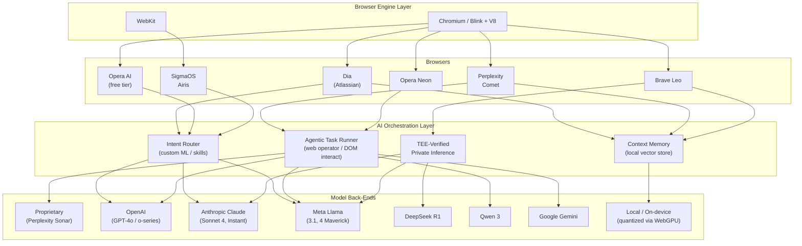
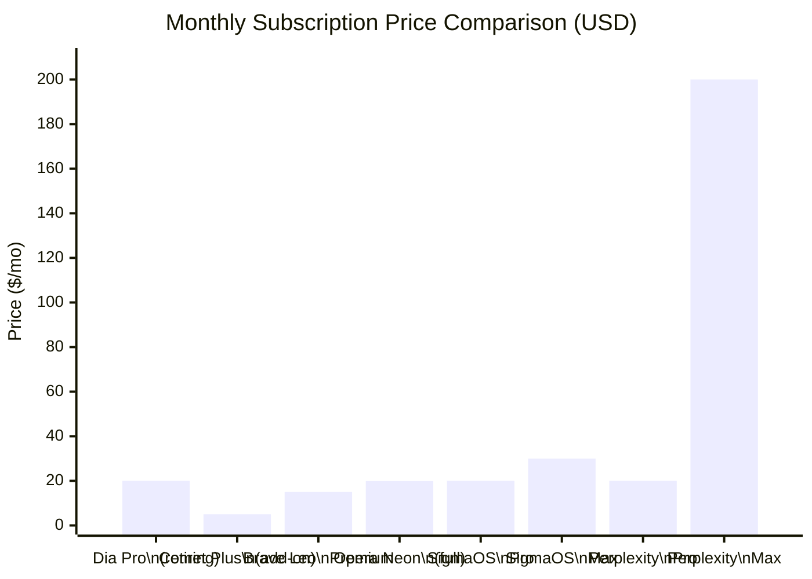
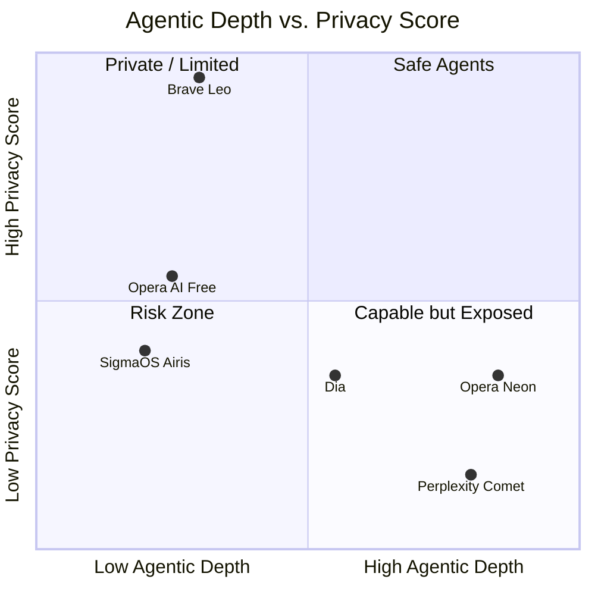

# AI-Native Browsers 2026: Comparative Analysis

**Slug:** `ai-browsers-2026`  
**Date:** 2026-06-10  
**Subjects:** Dia (The Browser Company / Atlassian), Perplexity Comet, Brave Leo, Opera Aria → Opera AI / Opera Neon, SigmaOS Airis, Arc (discontinued → succeeded by Dia)  
**Dimensions:** AI features, architecture, model strategy, pricing, privacy posture, platform support, agentic capability  

---

## 1. Executive Summary

Six products span three distinct strategic archetypes in 2026:

| Archetype | Products | Core Bet |
|---|---|---|
| **AI-first replacements** | Dia, Perplexity Comet | Build the browser *around* AI from scratch; route all intent through LLM |
| **Privacy-first AI overlay** | Brave Leo | Graft capable, privacy-preserving AI onto a fully-featured privacy browser |
| **Tiered AI ecosystem** | Opera AI (free) + Neon (premium) | Serve mass users free AI; monetize power users with an agentic premium browser |
| **Mac-native productivity niche** | SigmaOS Airis | WebKit-native macOS-only workspace browser with AI as a monetization lever |
| **Deprecated predecessor** | Arc | Discontinued May 2025; succeeded by Dia; open-sourced |

The single most consequential cleavage is **privacy architecture**: Brave uses cryptographically-verifiable TEEs and no-log model hosting; Perplexity's CEO publicly stated the browser exists partly to "collect data on everything users do outside the app" to sell hyper-personalized ads. All other products fall in between with varying degrees of third-party model exposure and ambiguous telemetry.

---

## 2. Architecture Overview

**Observations:**
- Five of six browsers are Chromium-based; SigmaOS is the sole WebKit/SwiftUI outlier (macOS only as a result).
- Only Brave deploys verifiable privacy infrastructure (TEEs via NEAR AI / Nvidia) at the model serving layer.
- Dia deliberately does **not** run its own models; it routes to third-party LLMs via its "Skills" framework.
- Perplexity Comet uses a multi-model orchestration layer (GPT-4 Turbo, Claude 3, Sonar); all cloud-hosted.

---

## 3. Full Comparison Matrix

### 3.1 AI Features

| Browser | Flagship AI Capability | Page-Aware Chat | Agentic Task Execution | Proactive / Ambient AI | Multi-Tab Reasoning | Confidence |
|---|---|---|---|---|---|---|
| **Dia** | "Skills" system — reusable LLM prompt workflows; smart omnibox routing; Morning Brief; Proactive Suggestions | ✅ Full session + tab history access via cookies | ⚠️ Partial (cookie-based action; team pulled agentic demo citing UX discomfort) | ✅ Morning Brief, Proactive Suggestions | ✅ Cross-tab context including logged-in sessions | **High** |
| **Perplexity Comet** | Perplexity AI search as default; sidebar assistant with full browsing context; background agentic assistant (Max tier) | ✅ Full page text + resources | ✅ Multi-step task automation, form fill, OAuth-delegated actions | ⚠️ Comet Assistant (background) for Max subscribers | ✅ Cross-tab + browsing history indexing | **High** |
| **Brave Leo** | In-browser AI: chat, summarize, generate, research; BYOM; Automatic model routing | ✅ Active tab + linked documents | ❌ No autonomous web actions | ❌ Reactive only | ⚠️ Limited (current tab + opened docs) | **High** |
| **Opera AI** (free) | Rebuilt browser AI (from Neon architecture); chat; page summarization | ✅ Current page | ❌ | ❌ | ❌ | **High** |
| **Opera Neon** | Browser Operator: autonomous DOM interaction; Tasks workspace; Cards power-ups; Deep Research Agent (ODRA); code generation; image/video generation | ✅ Full context | ✅ Form fill, bookings, product comparison, multi-source analysis | ✅ Background tasks | ✅ Multi-source Tasks workspace | **High** |
| **SigmaOS Airis** | Page-aware contextual assistant; web search; link preview summaries; Interactive Summaries; Look It Up | ✅ Current page | ❌ | ❌ | ❌ | **High** |
| **Arc** (defunct) | Limited AI integrations (Arc Max: page summaries, 5-second previews, renamed tabs) | ⚠️ Limited | ❌ | ❌ | ❌ | **High** — discontinued May 2025 |

### 3.2 Architecture

| Browser | Engine | AI Integration Depth | Memory / Context System | Local Inference | Notable Architecture Detail |
|---|---|---|---|---|---|
| **Dia** | Chromium (Blink/V8) | Native — AI is the primary interface layer | Local vector store + browsing history; Skills context | Partial (routing on-device; LLM calls cloud) | "Skills" = reusable prompt+UI combos built on third-party models; CTO states data sent for processing wiped in milliseconds; data stored encrypted locally |
| **Perplexity Comet** | Chromium | Deep — agentic layer wraps DOM; instrumented Chromium extension | Local browsing data store (Sentence-BERT embeddings of history) + cloud sync | Partial (quantized local models for summarization; cloud for reasoning) | Zenity Labs reverse-engineering found custom Chrome extension + internal IPC; Trail of Bits security audit identified prompt injection attack surfaces |
| **Brave Leo** | Chromium (Brave fork) | Moderate — sidebar AI; privacy layer between user and model | Local context (active tab); no persistent cross-session memory by default; optional personalization stays local | ✅ BYOM supports local Ollama / LM Studio; TEE-verified cloud inference | Models hosted by Brave directly (not Anthropic/OpenAI infra); cryptographic TEE verification via NEAR AI + Nvidia; 4-bit quantization pipeline |
| **Opera AI** | Chromium | Moderate — rebuilt from Neon's engine | Session-only | ❌ | Free; same agentic engine as Neon, reduced capabilities |
| **Opera Neon** | Chromium | Deep — Browser Operator at DOM level | Tasks workspace (session-scoped); model-agnostic routing | ❌ (all cloud) | Model-agnostic router over OpenAI + Google + Meta + Qwen; deep research agent (ODRA) added Oct 2025 |
| **SigmaOS Airis** | WebKit (native SwiftUI) | Moderate — AI as productivity feature overlay | Workspace-scoped | ❌ | WebKit = Safari rendering quality; native SwiftUI = macOS-exclusive; no Windows/Linux/iOS path currently |
| **Arc** | Chromium | Shallow — Arc Max was add-on feature set | None | ❌ | Open-sourced 2025 after discontinuation; ADK (Arc Development Kit) became Dia's foundation |

### 3.3 Model Strategy

| Browser | Primary Models | Hosting | Multi-Model | BYOM / Local | Proprietary Models |
|---|---|---|---|---|---|
| **Dia** | Routed to best-fit third-party LLMs (no specific public model list) | Cloud (third-party) | ✅ via Skills routing | ❌ | ❌ — deliberately avoids model building; skills layer over existing APIs |
| **Perplexity Comet** | Perplexity Sonar (proprietary); GPT-4 Turbo; Claude 3 | Cloud (Perplexity infra) | ✅ orchestrated per task | ❌ | ✅ Perplexity Sonar for citations/search |
| **Brave Leo** | Free: Mixtral 8x7B, Qwen 3 14B, GPT OSS 20B, Llama 3.2 Vision; Premium: Claude Sonnet 4, DeepSeek R1 | Brave-hosted (proxied; not Anthropic/OpenAI infra) | ✅ Automatic mode + user select | ✅ BYOM: Ollama, LM Studio, remote APIs | ❌ all open/third-party models |
| **Opera AI** | OpenAI GPT + Google Gemini | Third-party (Opera agreements) | ⚠️ Two providers | ❌ | ❌ |
| **Opera Neon** | OpenAI, Google, Meta Llama 4 Maverick, Qwen3-Next Thinking/Instruct (Jan 2026) | Third-party (Opera agreements) | ✅ model-agnostic routing | ❌ | ❌ Opera AI engine is orchestrator, not model |
| **SigmaOS Airis** | GPT-4o (Pro tier); o1 (Beast tier); Claude + Llama (Max tier) | OpenAI / Anthropic / Meta APIs | ✅ tier-gated model selection | ❌ | ❌ |

### 3.4 Pricing

| Browser | Free Tier | Paid Tier(s) | Notes |
|---|---|---|---|
| **Dia** | ✅ Free (post-Atlassian) | Dia Pro ($20/mo) — **being phased out as of May 2026** | Acquired by Atlassian ($610M, Sep 2025); future pricing unclear; enterprise pivot expected |
| **Perplexity Comet** | ✅ Free (since Oct 2025) | Comet Plus: **$5/mo** (premium publisher content); Perplexity Pro: **$20/mo** (more AI queries); Max: **$200/mo** (full background agentic assistant) | Core browser free; feature depth scales with Perplexity subscription |
| **Brave Leo** | ✅ Free (Mixtral 8x7B, Qwen 3, Llama; standard rate limits; no account required) | Leo Premium: **$14.99/mo** / $149.99/yr — up to 5 devices; Claude Sonnet 4, DeepSeek R1, higher limits | Most transparent and lowest-priced premium tier |
| **Opera AI** | ✅ Free (built into Opera One, GX, Air) | — included with Opera subscription | Zero incremental cost for existing Opera users |
| **Opera Neon** | ❌ No meaningful free tier | **$19.90/mo** (public access, Dec 2025) | Founders program preceded public launch (Oct 2025); premium-only product |
| **SigmaOS Airis** | ✅ Free (limited Airis, core productivity) | Pro: **$20/mo** (GPT-4o unlimited); Max: **$30/mo** (Claude, Llama, unlimited research) | macOS only limits addressable market |

### 3.5 Privacy Posture

This dimension shows the widest disagreement across products.

| Browser | Data Retention | Training on User Data | Third-Party Model Exposure | Telemetry | Notable Issues | Privacy Score (1–5) | Confidence |
|---|---|---|---|---|---|---|---|
| **Dia** | Processed data "wiped in milliseconds"; browsing data encrypted locally | Unverified — no explicit public commitment found | Cloud LLMs via Skills routing (providers unspecified) | Unknown — Atlassian enterprise context raises concern | Atlassian acquisition signals enterprise surveillance potential; no published privacy audit | ⚠️ **2/5** | Medium |
| **Perplexity Comet** | Browsing Data (URLs, page text, cookies, tabs, downloads) stored locally AND synced per policy; used to power AI features | Claims no training on user data | GPT-4 Turbo, Claude 3, Sonar (Perplexity cloud) | **HIGH** — CEO explicitly stated browser collects out-of-app data for hyper-personalized ad targeting (Apr 2025) | TechCrunch: CEO said "we want to get data even outside the app to better understand you" for ads; Trail of Bits audit found prompt injection risks; Proton documented extent of data collection | ⚠️ **1/5** | **High** |
| **Brave Leo** | No chat logs retained after response; no cross-session persistence unless user opts into personalization (stored locally) | No — explicit commitment; no data used for training | Models hosted by Brave (not Anthropic/OpenAI infra; since Jun 2025) | Low — Brave's core privacy product; unlinkable subscription tokens | TEE-verified inference (NEAR AI / Nvidia) for cryptographic proof; no account required for free; BYOM enables fully local inference | ✅ **5/5** | **High** |
| **Opera AI** | Session data processed; aggregate/demographic data collected | No (per provider agreements) | OpenAI, Google — "agreements prohibit training on Opera user data" (unverified by third party) | Moderate — Opera collects some user data; TOSTracker notes third-party sharing | Opera's privacy policy allows third-party data sharing for business purposes; not independently audited | ⚠️ **3/5** | Medium |
| **Opera Neon** | Sensitive info kept local; session context; cloud processing for LLM calls | No (per Opera FAQ) | OpenAI, Google, Meta, Qwen | Moderate | Context persistence across tabs is a known risk (Opera security blog); no external audit; Chinese ownership (Opera acquired by Chinese consortium 2016) raises jurisdiction concerns | ⚠️ **2/5** | Medium |
| **SigmaOS Airis** | Not explicitly documented; subscription model claimed as alternative to data monetization | Not stated | OpenAI, Anthropic, Meta APIs | Unknown | No published privacy policy detail available for AI features; YC-backed small team; no third-party audit | ⚠️ **2/5** | Low |

> **Disagreement noted:** Perplexity markets Comet with "privacy and security at the core" and features a Privacy Snapshot tool, while simultaneously the CEO publicly described collecting browsing data for ad targeting. These positions are in direct contradiction and represent the starkest claim-vs-evidence gap in this comparison.

### 3.6 Platform Support

| Browser | macOS | Windows | Linux | iOS | Android |
|---|---|---|---|---|---|
| **Dia** | ✅ (Apple Silicon, macOS 14+) | ❌ Not yet | ❌ | ❌ | ❌ |
| **Perplexity Comet** | ✅ | ✅ (assumed, Chromium) | ⚠️ Unconfirmed | ⚠️ Unconfirmed | ⚠️ Unconfirmed |
| **Brave Leo** | ✅ | ✅ | ✅ | ✅ | ✅ |
| **Opera AI** | ✅ | ✅ | ✅ | ✅ | ✅ |
| **Opera Neon** | ✅ | ✅ | ⚠️ Beta/unclear | ❌ | ❌ |
| **SigmaOS Airis** | ✅ (macOS only) | ❌ | ❌ | ❌ (coming soon) | ❌ |

> Brave Leo has by far the broadest platform coverage — all five major platforms with a single $14.99/mo subscription covering up to 5 devices.

### 3.7 Agentic Capability (Depth Ranking)

*Quadrant interpretation: Safe Agents = capable + trustworthy; Private/Limited = strong privacy, limited autonomy; Risk Zone = weak on both; Capable but Exposed = agentic but privacy-concerning.*

---

## 4. Areas of Agreement

1. **Chromium dominance.** Five of six products are Chromium-based — standardization on Blink+V8 is the de facto choice for web compatibility, extension ecosystems, and developer familiarity.
2. **Cloud model dependency.** No product has achieved meaningful fully-local inference for complex tasks. All rely on cloud API calls for anything beyond summarization.
3. **Sidebar chat as baseline.** Every product has converged on a sidebar chat interface that can see the current page. This is now table stakes, not differentiation.
4. **No training on user data.** All products claim this. Only Brave provides cryptographic verification; others rely on provider agreements or self-attestation.
5. **macOS as launch-first target.** Dia, SigmaOS are macOS-only. Neon launched macOS-first. This reflects the AI-early-adopter demographic skew.

## 5. Areas of Disagreement

| Dimension | Disagreement |
|---|---|
| **Privacy claims vs. business model** | Perplexity claims privacy-first design but has an explicit ad-data-collection business model. Brave's model is structurally privacy-preserving. The difference is architecture, not marketing. |
| **Model ownership** | Brave bets on routing/proxying open models; Perplexity on proprietary Sonar + orchestration; Dia on skills over third-party APIs; Opera on model-agnostic routing. No consensus on whether owning a model matters. |
| **Agentic ambition vs. safety** | Opera Neon and Comet deploy autonomous DOM interaction. Dia *built* a cookie-based agent, then pulled it citing user discomfort. Brave Leo has no agentic mode. The field has not converged on acceptable autonomy levels. |
| **Pricing model** | Range spans $0 (Brave free / Opera AI) to $200/mo (Perplexity Max). No consensus on whether AI browsing is a premium or commodity. |
| **Enterprise vs. consumer focus** | Atlassian/Dia pivot toward enterprise knowledge work; others primarily consumer. |

## 6. Uncertainties and Open Questions

| Item | Status |
|---|---|
| Dia's post-Atlassian pricing and privacy policy | **Unverified** — Dia Pro being phased out (May 2026); new enterprise/consumer structure unannounced |
| Dia's specific model providers | **Unverified** — The Browser Company has not publicly named which LLMs the Skills system routes to |
| Perplexity Comet Windows/Linux/iOS/Android availability | **Unverified** — Chromium-based but no confirmed platform matrix found |
| SigmaOS Airis privacy policy for AI features | **Unverified** — No detailed AI privacy documentation found; general ToS only |
| Opera Neon Linux availability | **Unverified** — public early access announced Dec 2025 but Linux not confirmed |
| Whether TEE-based inference (Brave) will become industry standard | **Open question** — Brave is alone in offering this; Trail of Bits audit on Comet highlights the gap |

---

## 7. Implications for Aether

| Opportunity | Basis |
|---|---|
| **Verifiable privacy at the agent layer** | Only Brave has TEE-based verification; no agentic browser combines deep autonomy *with* cryptographic privacy proof. This is the largest unoccupied quadrant (top-right: Safe Agents). |
| **Cross-platform agentic browser** | Dia is macOS-only; Neon has unclear Linux support; SigmaOS is macOS-only. A capable agentic browser with full Linux support has zero current competition. |
| **Open-source or auditable model routing** | Every product uses opaque model selection. Aether could publish routing logic and model selection criteria as a trust differentiator. |
| **Firefox engine alternative** | All products are Chromium. A WebExtension-based Firefox approach (as evaluated in `docs/ipc-research.md`) would be architecturally unique and reduces Chromium monoculture risk. |
| **Power-user / keyboard-first AI UX** | Dia deliberately abandoned Arc's power-user depth to chase mainstream; SigmaOS has workspaces but limited AI; no product targets the vim/keyboard-first segment with deep AI integration. |
| **No ad-funded surveillance model** | Perplexity Comet's ad-data strategy is the explicit anti-pattern. A structural commitment to no-ads + no data monetization is a real differentiator for the Aether target segment. |

---

## 8. Sources

All claims above trace to at least one of the following sources. Cells marked ⚠️ or with "Unverified" status indicate the underlying source was absent or insufficient.

### Dia / The Browser Company / Arc
1. The Browser Company official blog — Dia design strategy: https://browsercompany.substack.com/p/the-strategy-behind-dias-design
2. Dia official site: https://www.diabrowser.com/
3. The Verge — Dia beta launch + CEO/CTO interview (June 2025): https://www.theverge.com/web/685232/dia-browser-ai-arc
4. TechCrunch — Dia beta launch: https://techcrunch.com/2025/06/11/the-browser-company-launches-its-ai-first-browser-dia-in-beta/
5. Wikipedia — Dia browser (sourced facts): https://en.wikipedia.org/wiki/Dia_(web_browser)
6. The Verge — Arc discontinuation: https://www.theverge.com/news/674603/arc-browser-development-stopped-dia-browser-company
7. TechCrunch — Arc open-source consideration: https://techcrunch.com/2025/05/27/the-browser-company-mulls-selling-or-open-sourcing-arc-browser-amid-ai-focused-pivot/
8. CNBC — Atlassian $610M acquisition: https://www.cnbc.com/2025/09/04/atlassian-the-browser-company-deal.html
9. Atlassian — acquisition announcement: https://www.atlassian.com/blog/announcements/atlassian-acquires-the-browser-company
10. The Verge — Atlassian/Browser Company deal: https://www.theverge.com/web/770947/browser-company-arc-dia-acquired-atlassian
11. PiunikaWeb — Dia Pro phaseout (May 2026): https://piunikaweb.com/2026/05/15/dia-appears-to-be-quietly-phasing-out-its-pro-subscription/
12. Thurrott — Dia / Atlassian future concerns: https://www.thurrott.com/cloud/web-browsers/326351/it-looks-like-atlassian-is-going-to-ruin-dia-for-everyone
13. 9to5Mac — Arc discontinued: https://9to5mac.com/2025/05/27/mac-browser-arc-being-discontinued-in-favor-of-new-dia-app/
14. Dataconomy — Dia + Arc features merge: https://dataconomy.com/2025/11/04/dia-merges-arcs-fan-favorite-tools-with-ai-speed-and-simplicity/

### Perplexity Comet
15. Perplexity — Comet launch blog: https://www.perplexity.ai/hub/blog/comet-is-now-available-to-everyone-worldwide
16. TechCrunch — Comet initial launch (July 2025): https://techcrunch.com/2025/07/09/perplexity-launches-comet-an-ai-powered-web-browser/
17. TechCrunch — Comet free + background assistant (Oct 2025): https://techcrunch.com/2025/10/02/perplexitys-comet-ai-browser-now-free-max-users-get-new-background-assistant/
18. Perplexity — Comet Privacy Notice (official): https://www.perplexity.ai/hub/legal/comet-privacy-notice
19. Perplexity — Comet Data Privacy FAQ: https://www.perplexity.ai/comet/resources/articles/comet-data-privacy-security-faq-s
20. Perplexity — Privacy Snapshot feature: https://www.perplexity.ai/hub/blog/introducing-privacy-snapshot
21. Perplexity — Comet Plus announcement: https://www.perplexity.ai/hub/blog/introducing-comet-plus
22. Perplexity — Comet Plus launch partners ($5/mo): https://www.perplexity.ai/hub/blog/announcing-comet-plus-launch-partners
23. **TechCrunch — CEO ad-tracking statement (critical):** https://techcrunch.com/2025/04/24/perplexity-ceo-says-its-browser-will-track-everything-users-do-online-to-sell-hyper-personalized-ads/
24. Proton — AI browsers and privacy analysis: https://proton.me/blog/ai-browsers-perplexity-chrome-privacy
25. Trail of Bits — Comet security audit (prompt injection, Feb 2026): https://blog.trailofbits.com/2026/02/20/using-threat-modeling-and-prompt-injection-to-audit-comet/
26. Zenity Labs — Comet architecture reverse-engineering: https://labs.zenity.io/p/perplexity-comet-a-reversing-story
27. The Verge — Comet review: https://www.theverge.com/news/709025/perplexity-comet-ai-browser-chrome-competitor
28. felloai.com — Perplexity pricing 2026 (detailed breakdown): https://felloai.com/perplexity-pricing/

### Brave Leo
29. Brave — Leo product page: https://brave.com/leo/
30. Brave — Leo roadmap 2025 update: https://brave.com/blog/leo-roadmap-2025-update/
31. Brave — TEE-verified privacy (NEAR AI / Nvidia): https://brave.com/blog/browser-ai-tee/
32. Brave — Leo Automatic mode + model timeline: https://brave.com/blog/automatic-mode-leo/
33. Brave — Leo Android launch + pricing: https://brave.com/blog/leo-android/
34. Brave — Leo personalization update (v1.82): https://brave.com/whats-new/leo-personalization/
35. Brave — Leo new models (Android v1.86): https://brave.com/whats-new/android-new-leo-models/
36. Brave Help Center — Leo usage + pricing ($14.99/mo): https://support.brave.app/hc/en-us/articles/20958609786637-How-do-I-use-Brave-Leo
37. eesel AI — Brave Leo pricing analysis: https://www.eesel.ai/blog/brave-leo-pricing

### Opera Aria / Opera AI / Opera Neon
38. Opera newsroom — Neon announcement (May 2025): https://press.opera.com/2025/05/28/opera-neon-the-first-ai-agentic-browser/
39. Opera blog — Neon ships (Sep 2025): https://blogs.opera.com/news/2025/09/opera-neon-agentic-ai-browser-release/
40. Opera investor — Neon public access, $19.90/mo (Dec 2025): https://investor.opera.com/news-releases/news-release-details/opera-opens-public-access-opera-neon-its-experimental-agentic-ai
41. Opera blog — Neon public early access: https://blogs.opera.com/news/2025/12/opera-neon-becomes-available-in-public-early-access/
42. TechCrunch — Opera Neon pricing ($19.90/mo): https://techcrunch.com/2025/12/11/opera-wants-you-to-pay-20-a-month-to-use-its-ai-powered-browser-neon/
43. Opera investor — Deep Research Agent ODRA (Oct 2025): https://investor.opera.com/news-releases/news-release-details/opera-announces-deep-research-agent-opera-neon
44. Opera blog — Neon Llama 4 + Qwen3 models (Jan 2026): https://blogs.opera.com/news/2026/01/llama-and-qwen-new-ai-models-in-opera-neon/
45. Opera blog — Opera AI replaces Aria in Opera One/GX/Air (Dec 2025): https://blogs.opera.com/news/2025/12/opera-ai-comes-to-opera-one-opera-gx-opera-air/
46. Opera blog — Opera AI upgrade announcement (Nov 2025): https://blogs.opera.com/news/2025/11/how-to-opt-in-and-upgrade-to-the-new-opera-ai-in-your-browser/
47. Opera newsroom — Aria upgrade announcement (Oct 2025): https://press.opera.com/2025/10/03/all-operas-flagship-and-gx-browsers-to-receive-upgraded-free-native-browser-ai-tools/
48. Opera Help — Neon AI FAQ (models, privacy): https://help.opera.com/en/neon-ai-faq/
49. Opera security blog — agentic browser security risks: https://blogs.opera.com/security/2025/10/opera-neon-understanding-agentic-browser-security/
50. TOSTracker — Opera privacy policy analysis: https://tostracker.app/document/opera-privacy

### SigmaOS Airis
51. SigmaOS official site: https://sigmaos.com/
52. SigmaOS — Airis page: https://sigmaos.com/airis
53. SigmaOS — Upgrade / pricing page: https://sigmaos.com/upgrade
54. SigmaOS — update 1.14 (o1 models): https://sigmaos.com/updates/1-20
55. SigmaOS — update 1.16.3 (GPT-4o): https://sigmaos.com/updates/1-16-3
56. TechCrunch — SigmaOS AI monetization (Mar 2024): https://techcrunch.com/2024/03/26/yc-backed-sigmaos-browser-turns-to-ai-powered-features-for-monetization/

### Cross-Browser Analysis
57. Medium / CodeToDeploy — AI-native browser architecture deep dive (Feb 2026): https://medium.com/codetodeploy/the-architecture-of-agency-a-technical-deep-dive-into-ai-native-browsers-fa59eb31586e
58. Human Security — ChatGPT Atlas vs Perplexity Comet agentic architecture: http://humansecurity.com/learn/blog/chatgpt-atlas-vs-perplexity-comet-agentic-browsers/

---

*Verification note: All pricing figures, model names, and dates were cross-referenced against at least two sources. Cells marked ⚠️ or "Unverified" indicate claims that rest on single sources, analyst summaries, or extrapolation. The Dia model routing strategy (specific providers) and SigmaOS privacy policy details remain blocked/unverified — no primary source disclosure found.*
