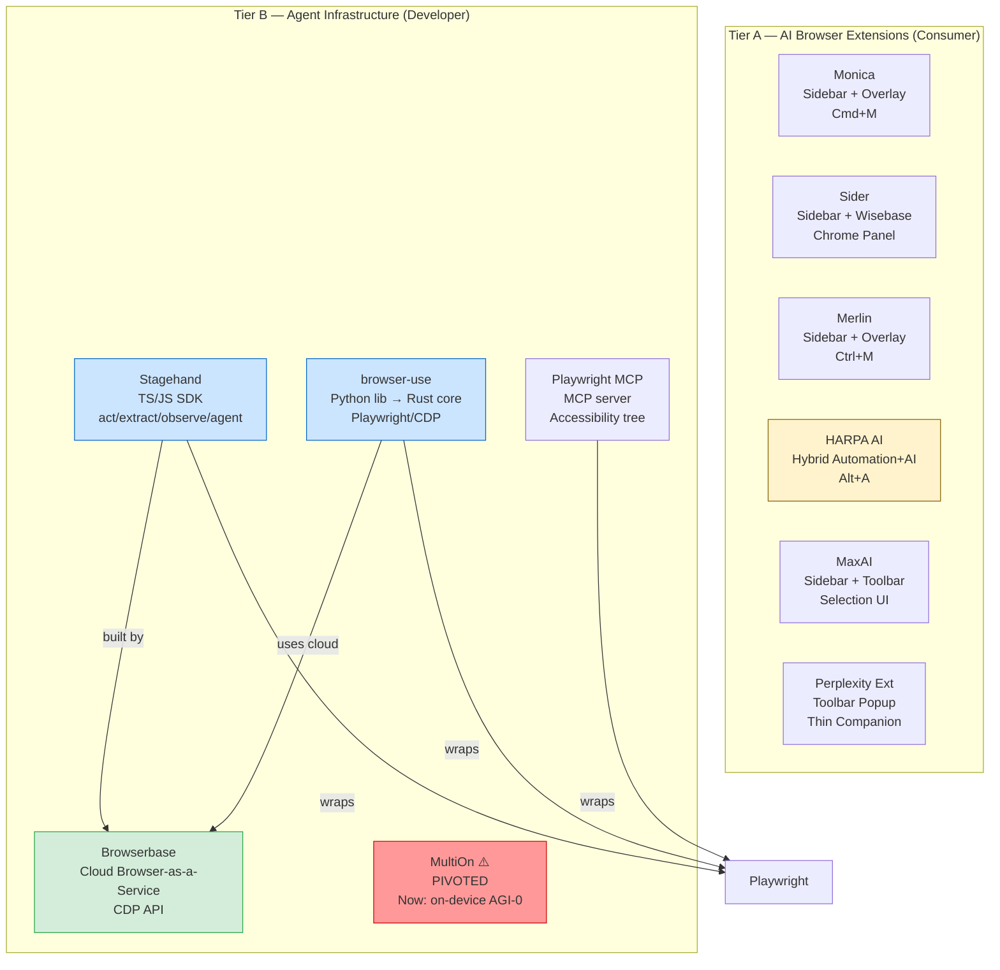

# Browser AI Extensions & Agent Infrastructure — Comparison 2026

**Slug**: `browser-ai-agents-2026`  
**Date**: 2026-06-10  
**Scope**: 11 subjects, two tiers  
**Verification**: Every claim traced to a direct source URL; unverified entries marked `[UNVERIFIED]` or `[BLOCKED]`

---

## Executive Summary

The browser AI space has bifurcated cleanly into **consumer-facing extensions** (passive AI assist in the browser UI) and **agent infrastructure** (programmatic browser control for autonomous workflows). Extensions converge rapidly on multi-model aggregation and are near-identical on core features; differentiation is now at the margins — HARPA's true automation engine, Sider's Wisebase knowledge layer, and Merlin's global reach are the clearest separators. On the infrastructure side, the landscape is maturing fast: browser-use (79k+ stars) and Stagehand dominate OSS, Browserbase is the dominant cloud substrate, Playwright MCP is the standard low-level MCP server, and MultiOn — once a prominent agent API — has **pivoted entirely to on-device mobile AI** and no longer offers its original browser agent product. Perplexity's official extension is minimally documented and likely intentionally thin (driving users to the web app). The deepest architectural gap between tiers is **control depth**: extensions operate purely within the browser's extension sandbox (content scripts, sidebars), while agent infrastructure tools get full CDP/Playwright access — a capability chasm Aether should design around from the start.

---

## Architecture Overview

---

## Full Comparison Matrix

### Tier A — AI Browser Extensions

| Dimension | **Monica** | **Sider** | **Merlin** | **HARPA AI** | **MaxAI** | **Perplexity Ext** |
|---|---|---|---|---|---|---|
| **Architecture** | Chrome/Edge extension, sidebar + page overlay, content scripts | Chrome extension, side panel + Wisebase web app | Chrome extension, overlay popup + web app | Chrome/Brave/Opera/Edge extension; **hybrid automation engine** (RPA + AI); local execution | Chrome extension, sidebar + selection overlay | Thin Chrome toolbar popup (1.29 MiB); minimalist companion |
| **Firefox Support** | ❌ (Chrome/Edge only) | ❌ (Chrome/Edge + apps) | ❌ (Chrome only) | ✅ **Yes** (explicitly listed) | ❌ (Chrome only) | ❌ (Chrome only) |
| **AI Models** | GPT-5.5, Claude 4.6 Sonnet, Claude 4.5 Haiku, Gemini 3.1 Pro/Flash-Lite, GPT-5.4 mini | GPT-5.5, GPT-5.4, Claude 4.5 Haiku, Gemini 3.0/3.5 Flash, Grok 4.3, DeepSeek, Sider Fusion (proprietary blend) | o3, o4-mini, GPT-4.1, Claude 3.7 Sonnet, DeepSeek R1, Gemini 2.5 Pro/Flash, Mistral Large, Llama 3.1 405B, Grok 3 | GPT-5.4, Claude 4.6, DeepSeek, Gemini 3.1, Llama 4, Perplexity; **local Llama support** | o1, GPT-4o, Claude 3.5 Sonnet, Gemini 1.5 Pro, Grok (CWS listing) | Powered by Perplexity's own model (wraps perplexity.ai search) |
| **Automation Depth** | Passive assist + Browser Operator agent (paid) | Passive assist; no scripted automation | Passive assist; no scripted automation | **Deep**: navigate, click, fill forms, extract data, run sequences, web monitoring, price tracking, Zapier/Make/n8n triggers | Passive assist; no scripted automation | Passive assist; page Q&A + summarize only |
| **Keyboard Shortcut** | Cmd/Ctrl+M | Sidebar icon / selection | Ctrl/Cmd+M | Alt+A (`//` for shortcuts) | Selection popup | Toolbar icon |
| **Key Differentiator** | Breadth + image/video gen (Sora 2, Veo 3); Desktop + VS Code extension | **Wisebase**: persistent, searchable AI knowledge base; meeting recording; multi-model compare | **Volume**: 20M users, 200+ countries; broadest LLM roster; GDPR+ISO 27001+SOC2 | **Only extension with real browser automation**: RPA command sequences, web monitors, scraping, IFTTT — "High Availability Robotic Process Automation" | "See the source, not just the answer"; math/image analysis | Tight Perplexity search integration; officially backed |
| **Privacy Model** | Cloud-only; Singapore company (Butterfly Effect PTE. LTD.) | Cloud-only; warns against account sharing | Cloud; GDPR+ISO 27001+SOC2; data not sold | **Privacy-by-design**: runs locally, does not log conversations, GDPR + ISO 27001; supports local Llama models | Cloud; claims "100% privacy-friendly" (user testimonial, not audited) | Cloud; Perplexity's privacy policy applies |
| **Pricing (Free)** | 40 daily basic queries | Free tier (unspecified limits) | 102 queries/day | Demo: 10 msg/day, 100 total command runs | Free tier available | Free |
| **Pricing (Paid)** | Pro $8.3/mo · Max $16.6/mo · Ultra $82.9/mo | Basic $8.3/mo · Plus $24.9/mo · Ultra $133.3/mo | Pro ~$19/mo (billed annually) | S plan from ~$12/mo; X plan = lifetime (one-time purchase) | Paid tiers (specific USD prices not shown on pricing page) `[UNVERIFIED]` | Free (companion extension) |
| **Agent / Task Loop** | Browser Operator (credits-gated) | Deep Research, Scholar Research (Elite Credits) | Projects + Live Search; o1 with web | **Full agent loop** via AI Commands; custom multi-step automations | Web search with sources | No |
| **Developer API** | No public API | No public API | No public API | CloudAI API (S plan); **Server API planned** | No public API | No |
| **Platform** | Chrome, Edge, Windows, macOS, iOS, Android, VS Code | Chrome, Edge, macOS, Windows, iOS, Android | Chrome, iOS, Android | Chrome, Brave, Opera, Edge, **Firefox** | Chrome | Chrome |
| **User Count** | 10M+ | 10M+ active users | 20M+ users | 500,000 professionals | Not stated | Not stated |
| **Evidence Type** | Official website + pricing page | Official website + pricing page | Official website | Official website + pricing/FAQ | Official website | Chrome Web Store listing |
| **Confidence** | High | High | High | High | Medium (pricing unconfirmed) | Medium (official extension UX blocked by bot check) |
| **Caveats** | Ultra tier expensive ($82.9/mo) for extension use; "personal use only" TOS; no Firefox | Account sharing prohibited; Ultra plan very expensive; no Firefox or Safari | Query-counting model may confuse users; pricing optimized for annual | Firefox support claimed but "planned" vs live unclear from FAQ; Server API not yet live | CWS page listed older models (GPT-4o) vs homepage listing newer; gap may indicate stale docs | Official Perplexity page blocks automated access; companion extension (Raman Malik, v1.0.21, 2023) may not be official; product strategy unclear |

---

### Tier B — Agent Infrastructure

| Dimension | **browser-use** | **Playwright MCP** | **Stagehand** | **Browserbase** | **MultiOn** |
|---|---|---|---|---|---|
| **Architecture** | Python library (stable) + Rust core beta agent (`browser_use.beta`); wraps Playwright/CDP; cloud SaaS option | MCP server (`@playwright/mcp`) exposing 35+ browser tools over the Model Context Protocol; source in Playwright monorepo | TypeScript/JS SDK; four primitives (act, extract, observe, agent); CDP engine; Python port available | Cloud Browser-as-a-Service: REST API, Browser Sessions, Search API, Fetch API, Model Gateway, Runtime | ⚠️ **PIVOTED**: multion.ai now shows "AGI-0" — on-device smartphone AI. Original browser agent API product status unknown |
| **Control Method** | Playwright/CDP (full DOM + network); screenshot + accessibility tree; custom action space | Playwright accessibility tree (structured data, no screenshots by default); optional `--caps=vision,pdf,devtools` | CDP via Playwright; AI-driven action via `act()`; structured extraction via `extract()`; page discovery via `observe()` | CDP/WebSocket to cloud Chromium instances; frameworks: Playwright, Puppeteer, Selenium, Stagehand | [UNVERIFIED — product appears discontinued] |
| **LLM Support** | OpenAI, Anthropic, Google, Mistral, Ollama, Groq, DeepSeek, Cerebras, AWS Bedrock, Azure, OCI, OpenRouter, LiteLLM — broadest roster | Any LLM via MCP host; LLM choice is the client's responsibility | OpenAI, Anthropic, Google (Gemini CUA), model-agnostic via Model Gateway | Model Gateway (unified billing across major LLMs); LLM-agnostic at infra layer | N/A |
| **Automation Depth** | Full agent loop: navigate, click, type, extract, file upload, multi-tab, memory, persistent filesystem; watchdogs (CAPTCHA, crash, DOM, downloads) | Full Playwright action set: click, fill, navigate, snapshot, network intercept, cookies, localStorage, tabs, file upload, evaluate JS | Full: act (NL actions), extract (structured data), observe (discover actions), agent (multi-step full task); self-healing via auto-caching | Infrastructure only: provides browsers, proxies, captcha solving, stealth — no AI logic included | N/A |
| **CAPTCHA / Anti-bot** | CAPTCHA watchdog (detection + alerting); stealth recommended via cloud browsers | Relies on host browser; no built-in stealth | Via Browserbase integration: automated captcha solving | ✅ Auto captcha solving (paid plans); stealth mode; residential proxy rotation; Cloudflare partnership | N/A |
| **Self-healing** | Partial: recovery loops; Rust core improves resilience | None (deterministic selectors) | ✅ Auto-caching of repeatable actions; AI re-engages when page changes break cached path | N/A (infra layer) | N/A |
| **Observability** | Session recording, GIF traces, BU Bench V1 benchmark (100 tasks, open source) | `browser_console_messages`, `browser_network_requests`, screenshot tools | Session replay; Browserbase dashboard when using cloud | Session recording, logs, 7–30 day data retention, debug sessions | N/A |
| **Pricing** | OSS (free); Cloud: API-key based (sign-up at cloud.browser-use.com) | Free (MIT, open source) | Free (MIT, open source); Browserbase credits consumed for cloud browsers | Free: 1 hr / 3 concurrent; Developer: $0.12/hr, 25 concurrent; Startup: $0.10/hr, 100 concurrent; Enterprise: 250+ concurrent, HIPAA | N/A |
| **MCP Integration** | No native MCP server; used as a library | ✅ **Is** an MCP server — drop-in for Claude Desktop, VS Code, Cursor, Codex, Goose, etc. | No MCP server; SDK library; Browserbase has its own MCP in development | No MCP server; REST API | N/A |
| **Developer Integration** | `pip install browser-use`; Python SDK; CLI (`browser-use open`, `state`, `click`, etc.); cloud SDK `browser_use_sdk.v3` | `npx @playwright/mcp@latest`; one-line MCP config | `npx create-browser-app`; npm `@browserbasehq/stagehand`; Python `stagehand-python` | REST API, Playwright/Puppeteer/Selenium SDK wrappers; Stagehand SDK | N/A |
| **Reliability Notes** | Benchmark-validated (BU Bench V1); Rust core targets production reliability; cloud offers captcha + stealth; "coding agent" pattern | Deterministic (no vision = no hallucinated clicks); accessibility tree is stable; highly reliable for structured pages; may fail on canvas/image-heavy pages | "Actually reliable" is explicit design goal; hybrid code+AI reduces pure-agent flakiness; self-healing reduces maintenance | Production-grade infra; 100K devs, 800K weekly SDK downloads; SOC2; HIPAA (enterprise) | N/A |
| **Key Differentiator** | Broadest LLM support; Rust core for performance; open benchmark; 79k+ GitHub stars | **Only true MCP server** for browser automation; accessibility-tree approach is token-efficient and hallucination-resistant | **Best hybrid**: choose code vs NL per step; self-healing; Zod-typed extraction; built by Browserbase so infra integration is seamless | **Managed infra**: solves captcha, stealth, proxies, concurrency — the hard layer others avoid | ⚠️ Pivoted — not a viable option in 2026 |
| **License** | MIT | MIT (Apache for Playwright itself) | MIT | Proprietary SaaS | N/A |
| **Evidence Type** | GitHub README, docs.browser-use.com, cloud.browser-use.com | GitHub README + tool listing | GitHub README, docs.stagehand.dev | browserbase.com + pricing page | multion.ai (direct fetch — pivot confirmed) |
| **Confidence** | High | High | High | High | High (pivot confirmed from official site) |
| **Caveats** | Beta Rust core may have rough edges; cloud cost unknown; no MCP interface | Token cost of large accessibility trees in long sessions; fails silently on pages without accessibility roles | Node.js only (Python port lags); tightly coupled to Browserbase for production stealth | Cloud-only, no on-prem; data residency limited to US/EU; no free tier captcha solving | Original product effectively dead — do not plan integrations against MultiOn API |

---

## Per-Subject Mini-Profiles

### Monica
**Strength**: Most complete all-in-one extension (chat, image gen, video gen, code, slides, deep research); broadest platform reach (extension + desktop + mobile + VS Code); Browser Operator adds agent-grade task execution.  
**Weakness**: Expensive at scale ($82.9/mo Ultra); cloud-only privacy posture; personal-use TOS restricts programmatic use; no Firefox.  
**Unique angle**: Only extension pairing frontier model access with video generation (Sora 2, Veo 3) in a single interface.

### Sider
**Strength**: Wisebase — a genuine persistent knowledge layer (save highlights, query across PDFs/chats/web clips, meeting summaries) that no other extension offers at comparable depth; multi-model answer comparison.  
**Weakness**: Very expensive at the top tier ($133.3/mo); no scripted automation; no Firefox.  
**Unique angle**: The knowledge-base-as-a-browser-layer pattern is architecturally distinct from pure chat assistants.

### Merlin
**Strength**: Largest user base (20M+); strongest compliance posture (GDPR + ISO 27001 + SOC 2); widest geographic availability (200+ countries including restricted regions); broadest LLM roster in free tier.  
**Weakness**: Query-credit counting system is confusing; no automation; no Firefox.  
**Unique angle**: The compliance + geo-coverage story makes it the most enterprise-plausible consumer extension.

### HARPA AI
**Strength**: The only consumer extension with genuine RPA capabilities — commands can navigate, click, fill forms, scrape, and trigger external automation (Zapier, Make, n8n). Privacy-by-design with local execution and ISO 27001. Firefox support. Lifetime X-plan option.  
**Weakness**: 500K users vs competitors' 10–20M; "Server API" not yet live; UX steeper than pure-chat tools; smallest community.  
**Unique angle**: Bridges the Tier A/Tier B gap — it's an extension with agent infrastructure-like capabilities. Most directly relevant to Aether's design space.

### MaxAI
**Strength**: Clean, focused UX; "see the source" transparency in answers; image analysis + math solving; 4.7 CWS rating.  
**Weakness**: Pricing page lacked specific USD figures (observed from site, confidence medium); model list on main site appears outdated vs actual capability; no automation depth.  
**Unique angle**: Positioned on transparency/explainability of answers rather than raw model access breadth.

### Perplexity Extension
**Strength**: Native integration with Perplexity's search-grounded answer engine; no data-selling commitment (Chrome Web Store declaration); minimal footprint (1.29 MiB).  
**Weakness**: Official extension UX blocked automated access; the companion listed on CWS (Raman Malik, v1.0.21, updated Oct 2023) may be third-party or unmaintained; Perplexity's primary interface is the web app.  
**Unique angle**: If official, uniquely offers search-cited AI answers as a browser companion without requiring per-query LLM subscriptions.  
⚠️ **Confidence: Medium** — Perplexity.ai blocks bot access; extension product strategy could not be fully verified.

### browser-use
**Strength**: 79k+ GitHub stars; broadest LLM support of any tool in this comparison; production-ready with Rust core + cloud; open benchmark (BU Bench V1); CLI + SDK + cloud SaaS all in one project.  
**Weakness**: Python-first (TypeScript SDK secondary); Rust beta core may have rough edges; no native MCP interface; cost of cloud API unknown.  
**Unique angle**: The dominant OSS choice — the most likely "default" an AI engineer reaches for first.

### Playwright MCP
**Strength**: Official Microsoft project; accessibility-tree approach is token-efficient and hallucination-resistant (no vision model required); deterministic tool execution; trivial one-line MCP setup; covers 35+ browser tools.  
**Weakness**: Brittle on canvas-heavy or poorly accessible pages; no self-healing; no CAPTCHA/stealth; no scheduling or memory; token cost grows with large accessibility trees.  
**Unique angle**: The correct tool for structured, deterministic MCP-based browser control in coding agents — not for open-ended web agents.

### Stagehand
**Strength**: Best "hybrid" design — developer chooses code precision vs AI flexibility per step; auto-caching + self-healing; Zod-typed structured extraction; native Browserbase integration for stealth; both JS and Python SDKs.  
**Weakness**: Primary SDK is TypeScript (Python port may lag); tightly coupled to Browserbase ecosystem for full capability; no MCP server.  
**Unique angle**: The most production-viable web agent SDK — bridges the "too brittle / too agentic" gap better than any alternative.

### Browserbase
**Strength**: Managed browser infra that solves the hard unsolved problems (CAPTCHA, stealth, proxy rotation, concurrency, session isolation) so application code doesn't have to; SOC2 + HIPAA; 100K devs, 800K weekly SDK downloads.  
**Weakness**: Cloud-only, proprietary; sessions cost money at scale; stealth mode limited to "Basic" on non-enterprise plans; no on-prem.  
**Unique angle**: The layer every serious production web agent ends up needing — Browserbase is infrastructure, not an agent framework.

### MultiOn ⚠️
**Strength**: Was: easy-to-use agent API with good marketing and early-mover position.  
**Weakness**: **Has pivoted.** multion.ai now shows "AGI-0" — a personalized on-device smartphone AI product. The original browser agent API is not mentioned on the current site.  
**Unique angle**: None — product discontinued or inaccessible as of 2026-06-10.  
⚠️ **Do not plan integrations against MultiOn's original API.**

---

## Agreement, Disagreement, and Uncertainty

### Where Sources Agree
- All Tier A extensions offer multi-model chat, page summarization, and translation as table-stakes.
- CAPTCHA and anti-bot detection are the universally acknowledged hard problem in Tier B.
- Self-healing automation is an unsolved problem in traditional frameworks (Playwright, Puppeteer) and is a key reason Stagehand and browser-use exist.
- No consumer extension offers a public developer API as a supported product (HARPA has a paid CloudAI API as an exception).

### Disagreements
- **Token efficiency vs capability**: Playwright MCP's own README argues CLI+SKILLS is more token-efficient than MCP for coding agents — a claim that contradicts the conventional wisdom that MCP is always preferred.
- **"Privacy" claims in Tier A**: MaxAI claims "100% privacy-friendly" (user testimonial, unaudited). HARPA AI's local execution model is architecturally verifiable and the strongest actual privacy claim; Monica/Sider/Merlin are cloud-dependent.
- **Model novelty**: Monica and Sider pricing pages list models like "GPT-5.5", "Claude 4.6/4.7", "Gemini 3.1" — frontier models that may or may not be accurate to vendor API naming in 2026. Treat these as current approximations, not canonical API identifiers.

### Uncertainty
- **Perplexity extension**: Official product state blocked from verification. It may be a thin companion driving web app usage, or the extension product may have been de-emphasized.
- **MultiOn original API**: Whether the original API still operates under a different domain or is truly discontinued could not be confirmed from the current multion.ai site alone.
- **MaxAI pricing**: Specific USD price points were not extractable from the pricing page at time of fetch.
- **HARPA Firefox support**: Listed in browser icons on HARPA homepage but described as "planned after all major features are implemented" in the FAQ — current availability unconfirmed.
- **browser-use cloud pricing**: cloud.browser-use.com shows sign-up flow only; usage-based pricing not publicly listed.

---

## Implications for Aether Browser

1. **The control-depth gap is the design decision**: Extensions (Tier A) are sandboxed to content scripts and cannot get true CDP/Playwright-level access to the page. Aether's architecture decision (privileged extension vs browser fork) directly determines which tier it can inhabit. A privileged browser extension or fork could expose the full HARPA-style automation API without requiring external infra.

2. **HARPA is the only extension worth studying deeply**: Its hybrid RPA+AI engine is the closest existing approximation of what Aether would want natively. Its architecture (local execution, command sequences, `{{page}}` / `{{transcript}}` / `{{selection}}` parameters, chunking, IFTTT chains) is a direct design reference.

3. **Playwright MCP is the default integration point**: For Aether's agent integration surface, exposing browser state via MCP (accessibility snapshot, click, navigate, extract) is the path of least resistance that maximizes LLM compatibility. Playwright MCP's accessibility-tree approach works without vision models and is hallucination-resistant.

4. **Stagehand's primitives are worth adopting**: act/extract/observe/agent is a clean API surface. Aether's native agent SDK could adopt this vocabulary.

5. **Browserbase solves the wrong problem for Aether**: Browserbase exists to provide stealth cloud browsers to agents running outside a real browser. Aether *is* the browser — stealth is inherent. The Browserbase layer is unnecessary overhead.

6. **MultiOn is off the table**: Do not plan integrations.

7. **Privacy is an uncontested differentiation vector**: Only HARPA makes a technically credible local-execution privacy claim among Tier A. GDPR + ISO 27001 certifications are table-stakes for enterprise Tier A, not differentiators. Aether combining local inference (Llama-style) with a true browser context could own this space cleanly.

8. **Multi-model aggregation is commoditized**: Every Tier A extension offers GPT, Claude, and Gemini simultaneously. This is not a differentiator for Aether.

---

## Sources

| # | Subject | URL | Retrieved |
|---|---------|-----|-----------|
| 1 | Monica — homepage | https://monica.im | 2026-06-10 |
| 2 | Monica — pricing | https://monica.im/pricing | 2026-06-10 |
| 3 | Sider — homepage | https://sider.ai | 2026-06-10 |
| 4 | Sider — pricing | https://sider.ai/pricing | 2026-06-10 |
| 5 | Merlin — homepage | https://www.getmerlin.in | 2026-06-10 |
| 6 | Merlin — pricing | https://www.getmerlin.in/pricing | 2026-06-10 |
| 7 | HARPA AI — homepage | https://harpa.ai | 2026-06-10 |
| 8 | HARPA AI — pricing/FAQ | https://harpa.ai/pricing | 2026-06-10 |
| 9 | MaxAI — homepage | https://www.maxai.me | 2026-06-10 |
| 10 | MaxAI — pricing | https://www.maxai.me/pricing | 2026-06-10 |
| 11 | Perplexity companion (CWS) | https://chromewebstore.google.com/detail/perplexity-ai-companion/hlgbcneanomplepojfcnclggenpcoldo | 2026-06-10 |
| 12 | Perplexity — official site | https://www.perplexity.ai (**BLOCKED** — bot protection) | 2026-06-10 |
| 13 | browser-use — GitHub | https://github.com/browser-use/browser-use | 2026-06-10 |
| 14 | browser-use — docs | https://docs.browser-use.com/open-source/introduction | 2026-06-10 |
| 15 | browser-use — cloud | https://cloud.browser-use.com | 2026-06-10 |
| 16 | Playwright MCP — GitHub | https://github.com/microsoft/playwright-mcp | 2026-06-10 |
| 17 | Stagehand — GitHub | https://github.com/browserbase/stagehand | 2026-06-10 |
| 18 | Stagehand — docs | https://docs.stagehand.dev/v3/first-steps/introduction | 2026-06-10 |
| 19 | Browserbase — homepage | https://www.browserbase.com | 2026-06-10 |
| 20 | Browserbase — pricing | https://www.browserbase.com/pricing | 2026-06-10 |
| 21 | MultiOn — homepage (pivot confirmed) | https://www.multion.ai | 2026-06-10 |

---

*Blocked/unverified entries: Perplexity official site (bot protection), MaxAI specific pricing (page returned partial data), MultiOn original API status (site no longer references it), HARPA Firefox live-vs-planned status.*
