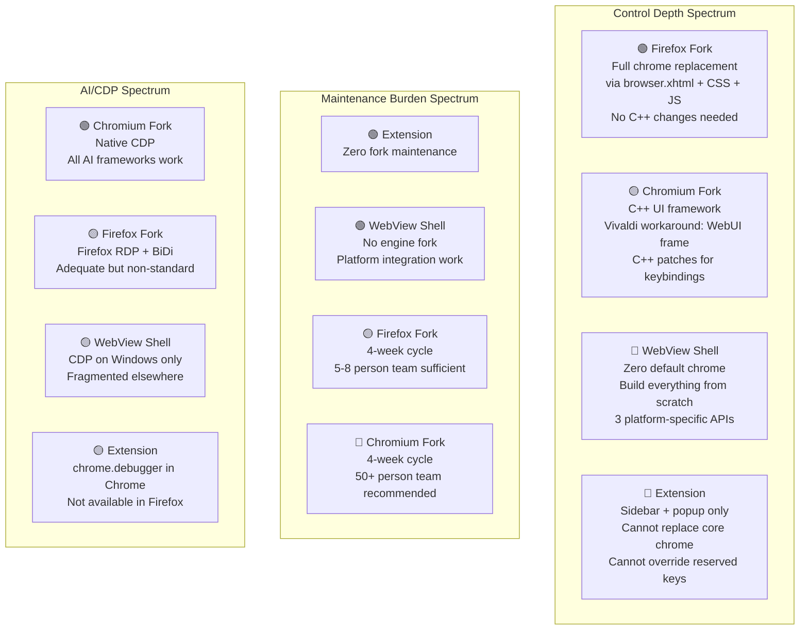

# Browser Delivery Vehicle Comparison

**Question**: Which delivery vehicle should an AI-native, keyboard-first, privacy-respecting browser use in 2026?

**Date**: 2026-06-10

---

## Executive Summary & Recommendation

**Recommended: Firefox/Gecko fork** — with a Chromium/CEF fork as the credible fallback.

The Firefox/Gecko fork wins on the aggregate of: (1) deepest chrome-level customization without engine-level C++ changes, (2) best licensing posture (MPL-2.0), (3) proven zero-chrome and modal-keybinding feasibility (Zen Browser), (4) adequate AI/IPC through Firefox Remote Debugging Protocol + native messaging, and (5) a manageable fork-maintenance burden for a small team (LibreWolf operates with <10 active contributors). Its main weaknesses are smaller extension ecosystem vs Chrome and inferior CDP support (no native CDP, only the Firefox RDP). For an AI-native, keyboard-first, privacy-first project, these tradeoffs favor Gecko.

A Chromium/CEF fork would be the choice if Chrome Web Store extension compatibility is non-negotiable or if CDP-native AI agent integration is the primary differentiator. But Chromium forks carry heavier maintenance burden, Google dependency risks, and significantly harder zero-chrome customization (Vivaldi's entire custom UI is a web app running inside a WebUI frame — a clever workaround, not deep integration).

The WebView shell and privileged extension options are eliminated: WebView cannot support extensions at all (dealbreaker), and extensions cannot override reserved keyboard shortcuts or fully replace browser chrome (dealbreaker for keyboard-first and zero-chrome goals).

---

## Comparison Matrix

| Dimension | Firefox/Gecko Fork | Chromium/CEF Fork | WebView Shell | Privileged Extension |
|---|---|---|---|---|
| **Control** | ★★★★★ Full chrome replacement via `browser.xhtml` + `userChrome.css` + XUL/XHTML overlays. Network stack access via `nsIChannel`. | ★★★★☆ Custom UI possible (Vivaldi does it as a web app in a WebUI frame). C++ accelerator table must be patched for full keyboard control. | ★★★☆☆ Full UI control (you build it all). But limited network interception, no cookie/storage API depth, platform-fragmented. | ★★☆☆☆ Sidebar, popup, new tab page, devtools panel only. Cannot replace address bar, tab strip, or window chrome. |
| **Fork Maintenance** | ★★★★☆ 4-week release cycle. LibreWolf (~5-8 contributors) manages it. Zen Browser (1 primary dev + community) manages it. Smaller codebase than Chromium. | ★★☆☆☆ 4-week release cycle. Brave has ~700 employees. Vivaldi has ~50+. Chromium build requires 100GB+ disk, 16GB+ RAM. Rebase pain is well-documented. | ★★★★★ No engine fork. But need 3 separate WebView integrations (Win/Mac/Linux). Tauri abstracts some of this. | ★★★★★ No fork at all. But API deprecation risk (MV2→MV3 broke many extensions). Store policy risk. |
| **Extension Compat** | ★★★☆☆ Firefox WebExtension API is ~85-90% compatible with Chrome's. Missing: `chrome.debugger` (not implemented), `declarativeContent`, some Chrome-only APIs. Firefox-only advantages: `sidebarAction`, `dns`, `pkcs11`, `contextualIdentities`, `proxy.onRequest`. | ★★★★★ Full Chrome Web Store access. 200,000+ extensions. MV3 enforced but forks can maintain MV2 (Brave still supports it partially). | ★☆☆☆☆ No WebExtension support at all. Userscript-level only. Nyxt has its own Lisp extension system. Tauri has plugin system but not web extensions. | ★★★★★ You ARE an extension. Can coexist with others. `management` API can list (not control) other extensions. |
| **AI/IPC/CDP** | ★★★☆☆ Firefox RDP (actor-based JSON protocol) is powerful but non-standard. No native CDP support. WebDriver BiDi supported. Native messaging works. `exportFunction`/`cloneInto` for privileged page interaction. | ★★★★★ CDP is the gold standard for AI agent integration. Puppeteer, Playwright, all major AI agent frameworks target CDP. Custom CDP domains possible in a fork. Native messaging works. | ★★☆☆☆ WebView2 exposes CDP. WKWebView has limited WebKit inspector protocol. WebKitGTK has `WebKitWebInspector` API. No unified cross-platform protocol. | ★★★☆☆ `chrome.debugger` API gives CDP access in Chrome (not in Firefox — bug 1316741). Native messaging for AI agent IPC. `tabs`, `webRequest` APIs for observation. |
| **Zero-Chrome & Keybinding** | ★★★★★ `browser.xhtml` modification gives complete chrome control. Zen Browser proves zero-chrome feasible. `userChrome.css` can hide everything. Keyboard events can be intercepted before Firefox's accelerator table via XUL `keydown` handlers at the top-level window. | ★★☆☆☆ Chromium's C++ accelerator table is hardcoded. Vivaldi works around this by running its entire UI as a web app. Fully stripping chrome requires deep C++ patches. `--app` mode is partial. | ★★★★★ No default chrome at all — you build everything from scratch. Full keyboard control since you own the event loop. Nyxt and Surf prove this works. | ★☆☆☆☆ Cannot override Ctrl+W, Ctrl+T, Ctrl+N, Ctrl+Tab, Ctrl+Shift+Tab. `commands` API limited to ~4 suggested shortcuts. Cannot hide address bar or tab strip. |
| **Licensing** | ★★★★★ MPL-2.0: file-level copyleft, permissive for proprietary additions. No trademark issues if you don't use Firefox name/logo. Patent grant included. | ★★★★☆ BSD-3-Clause: maximally permissive. But: Google CLA required for upstream contributions. Dependency on Google services (Safe Browsing, component updater) must be removed. No patent grant beyond BSD. | ★★★☆☆ WebView2: proprietary Microsoft license (Windows-only). WKWebView: Apple-only (macOS/iOS). WebKitGTK: LGPL-2.1 (Linux-only). No single cross-platform open license. | ★★★★★ No engine licensing. But: Chrome Web Store / Firefox AMO policies. Store can reject or remove extensions. Sideloading possible but hostile UX in Chrome. |

**Confidence legend**: ★★★★★ = Strong fit | ★★★★☆ = Good fit | ★★★☆☆ = Adequate | ★★☆☆☆ = Weak | ★☆☆☆☆ = Dealbreaker risk

---

## Detailed Analysis by Dimension

### 1. Control (UI/Chrome Customization Depth)

#### Firefox/Gecko Fork — Deepest customization without C++ changes

Firefox's UI is built on a privileged web technology stack (`browser.xhtml`, CSS, JavaScript). This means:

- The entire browser chrome (tabs, address bar, sidebar, toolbars) can be restyled or hidden via `userChrome.css`
- The chrome DOM can be modified at runtime via privileged JavaScript
- New UI elements can be injected via XUL/XHTML overlays
- Network stack is accessible via XPCOM interfaces (`nsIChannel`, `nsIHttpChannel`)
- Zen Browser demonstrates full chrome replacement: vertical tabs, compact mode, split view — all without engine-level C++ changes

**Evidence**: Zen Browser ships a radically redesigned Firefox UI using only the Firefox toolkit layer (CSS + JS + `browser.xhtml` modifications). LibreWolf strips telemetry and modifies defaults using patch files against Firefox's build system.

#### Chromium/CEF Fork — Powerful but requires deeper patching

Chromium's UI is C++ (Views framework on Windows/Linux, Cocoa on macOS). Customizing it requires:

- Modifying C++ source files and recompiling
- Vivaldi's workaround: runs its entire UI as a web app inside a `WebUI` frame, effectively replacing Chromium's native chrome with a React-like web app
- Arc took a similar approach before shutting down
- CEF (Chromium Embedded Framework) gives you a chromeless webview with C++ API, but you lose the browser shell entirely

**Evidence**: Vivaldi's `vivaldi://` scheme hosts their custom UI. This is clever but creates a Chrome-within-Chrome architecture that adds complexity and performance overhead.

#### WebView Shell — Full control but you build everything

WebView gives you a bare rendering surface. You own the entire UI:

- No default chrome to fight against
- Full control over keyboard event dispatch
- But you must build tabs, address bar, bookmarks, downloads, etc. from scratch
- Cross-platform requires 3 different WebView APIs

**Evidence**: Nyxt browser (WebKitGTK) builds its entire UI in Common Lisp. Surf (suckless) is a minimal WebKitGTK browser in ~2000 lines of C. Tauri provides a cross-platform abstraction but is designed for apps, not browsers.

#### Privileged Extension — Severely limited

Extensions can only control: sidebar panel, popup, new tab page, devtools panel, theme colors. They cannot:

- Replace the address bar
- Replace the tab strip
- Remove window decorations
- Control window chrome layout

**Evidence**: MDN `sidebarAction` API, Chrome `sidePanel` API — both provide a panel alongside existing chrome, not a replacement for it. No API exists to hide the address bar from an extension.

### 2. Fork-Maintenance Burden

#### Firefox/Gecko — Manageable for small teams

| Project | Team Size | Status | Notes |
|---------|-----------|--------|-------|
| LibreWolf | ~5-8 active contributors | Active | Patches Firefox build config, ships within days of upstream |
| Waterfox | 1 primary developer | Active | Maintains separate patch set |
| Zen Browser | 1 primary + community | Active, growing | Focuses on UI, rides Firefox ESR or release |
| Floorp | Small team (Japan-based) | Active | Enterprise-focused fork |

Firefox has a **4-week release cycle** (ESR every ~52 weeks). The codebase is ~25 million lines (smaller than Chromium's ~35 million). Build requirements: ~30-40GB disk, 8GB+ RAM.

**Key risk**: Mozilla could change internal APIs that fork patches depend on. The shift from XUL to `browser.xhtml` (Firefox 70+) broke many classic add-ons but stabilized the platform.

#### Chromium/CEF — Heavy burden, requires significant resources

| Project | Team Size | Status | Notes |
|---------|-----------|--------|-------|
| Brave | ~700 employees (full company) | Active | Major engineering investment |
| Vivaldi | ~50+ employees | Active | Custom UI layer on top |
| ungoogled-chromium | ~5-10 contributors | Active | Patch series, no custom features |
| Nickel Browser | Small team | Early stage | Built on ungoogled-chromium binary + patches |

Chromium has a **4-week release cycle** and ~35 million lines of code. Build requirements: **100GB+ disk, 16GB+ RAM, multi-hour builds**. Google actively discourages forks through:

- Removing APIs that only forks use
- Increasing build complexity
- MV3 enforcement that breaks privacy extensions
- Component updater dependencies

**Key risk**: Google's increasing control over the Chromium codebase. The "AMP for email", "Privacy Sandbox", and MV3 decisions all favored Google's interests over fork maintainers'.

**Evidence**: Nickel Browser (Chromium fork) uses a patch-series approach against ungoogled-chromium, with 17 patches for branding, privacy defaults, adblock, and tor integration. Chromium version tracked: 146.0.7680.177-1.

#### WebView Shell — No engine maintenance, but platform fragmentation

No engine fork needed. But cross-platform maintenance is non-trivial:

- **WebView2** (Windows): Tied to Edge's update cycle. Windows-only. **Not available on Linux** as of 2026.
- **WKWebView** (macOS/iOS): Apple-only. Limited API surface. No Linux/Windows.
- **WebKitGTK** (Linux): LGPL. Active project. GTK dependency.

**Critical blocker**: There is no single cross-platform WebView that covers Windows + macOS + Linux. You need three separate integrations. Tauri abstracts this but is designed for apps, not browsers.

**Evidence**: Microsoft WebView2 docs explicitly state Windows-only support. No Linux port announced as of 2026-06-10. Tauri 2.0 supports Android/iOS but uses platform-specific WebViews.

#### Privileged Extension — Zero fork maintenance, but API instability

No fork maintenance. But:

- MV2→MV3 migration broke many extensions (Tree Style Tab, uBlock Origin had to adapt)
- Browser updates can break extension behavior without warning
- Store review policies can reject or remove extensions
- Chrome increasingly hostile to sideloading

### 3. Extension Compatibility

#### Firefox — Good but not complete

Firefox WebExtension API covers most of Chrome's APIs with key gaps:

| API | Firefox | Chrome | Notes |
|-----|---------|--------|-------|
| `debugger` (CDP access) | ❌ Not implemented (bug 1316741) | ✅ Full | Critical for AI agent integration |
| `declarativeContent` | ❌ Not implemented | ✅ Full | |
| `sidebarAction` | ✅ Full | ❌ (uses `sidePanel` instead) | Firefox advantage |
| `contextualIdentities` | ✅ Full | ❌ | Container tabs — Firefox advantage |
| `dns` | ✅ Full | ✅ Full | |
| `proxy.onRequest` | ✅ Dynamic | ❌ (static config only) | Firefox advantage for privacy |
| `pkcs11` | ✅ Full | ❌ | Smart card support |
| `webRequest` (blocking) | ✅ Full (MV2 & MV3) | ⚠️ Limited in MV3 | Firefox preserves blocking webRequest |

Firefox supports both `browser` and `chrome` namespaces, making many Chrome extensions work without modification.

**Evidence**: MDN Chrome incompatibilities page (updated Jan 2026). Firefox maintains `webRequest` blocking in MV3 while Chrome moved to `declarativeNetRequest`.

#### Chromium — Full Chrome Web Store access

200,000+ extensions. MV3 is enforced but forks can:

- Maintain MV2 support (Brave partially does this)
- Diverge on `webRequest` blocking behavior
- Add custom extension APIs

#### WebView — No extension support

Dealbreaker for a browser product. Nyxt has its own Lisp-based extension system. Tauri has a plugin system. Neither supports the WebExtension standard.

### 4. AI/IPC/CDP Capability

#### Firefox — Adequate via RDP + native messaging

Firefox Remote Debugging Protocol (RDP) is an actor-based JSON protocol:

- **Capabilities**: Tab enumeration, JavaScript debugging, DOM inspection, network monitoring, console evaluation, source manipulation, breakpoints
- **Architecture**: Server-side actors (root, tab, thread, source, etc.) communicate via JSON packets over a byte stream
- **Supports**: WebDriver BiDi (emerging standard for browser automation)
- **Does NOT support**: Chrome DevTools Protocol (CDP) natively

For AI agent integration, the combination of:
1. Firefox RDP (for browser observation/control)
2. Native messaging (for extension ↔ AI agent communication)
3. `exportFunction`/`cloneInto` (for privileged page interaction with Xray protection)

...is adequate but non-standard. AI agent frameworks (Puppeteer, Playwright) have Firefox support via WebDriver BiDi, but CDP remains the richer protocol.

**Evidence**: Firefox Source Docs — Remote Debugging Protocol specification (81,000+ chars of detailed protocol documentation). The protocol supports multi-client connections, thread debugging, lexical environment inspection, and breakpoint management.

#### Chromium — CDP is the industry standard

Chrome DevTools Protocol is the de facto standard:

- **Domains**: DOM, Debugger, Network, Runtime, Page, Emulation, Performance, Security, etc.
- **Ecosystem**: Puppeteer, Playwright, Selenium 4, every major AI agent framework
- **HTTP endpoints**: `/json/version`, `/json/list`, `/json/protocol`, `/json/new`, `/json/activate`, `/json/close`
- **WebSocket**: Full bidirectional protocol per tab
- **Multi-client**: Supported since Chrome 63
- **Extension access**: `chrome.debugger` API provides CDP access from within extensions

A Chromium fork can add custom CDP domains for AI-specific functionality.

**Evidence**: Chrome DevTools Protocol documentation. The protocol is defined in `.pdl` files in the Chromium source tree and published as an NPM package.

#### WebView — Platform-fragmented

- **WebView2**: Exposes CDP (it's Chromium-based). Best option.
- **WKWebView**: Limited WebKit inspector protocol. Not CDP-compatible.
- **WebKitGTK**: `WebKitWebInspector` API. Not CDP-compatible.

No unified cross-platform debugging/automation protocol.

#### Extension — Partial CDP via `chrome.debugger`

Chrome's `chrome.debugger` API provides CDP access from an extension, but:

- **Not available in Firefox** (bug 1316741 — not implemented)
- Requires user permission prompt
- Cannot attach to extension pages
- Opening DevTools disconnects the debugger

### 5. Zero-Chrome and Native Modal Keybinding Feasibility

This dimension is critical for a keyboard-first browser.

#### Firefox — Proven feasible

**Zero chrome**: Zen Browser proves you can completely replace Firefox's chrome:
- Hide all default toolbars via `userChrome.css`
- Replace with custom sidebar, tab management, address bar
- Compact mode hides even the custom chrome

**Modal keybindings**: Firefox's privileged JavaScript can intercept keyboard events at the `browser.xhtml` window level, before Firefox's built-in accelerator handling. A fork can:
- Remove or remap all built-in shortcuts
- Implement vim-like modal input (normal/insert/command modes)
- Intercept Ctrl+W, Ctrl+T, Ctrl+N at the XUL/XHTML level

**Evidence**: Zen Browser's compact mode, split view, and workspace features. Tridactyl extension demonstrates vim keybindings within extension limitations (but a fork can go further).

#### Chromium — Difficult, requires C++ patches

**Zero chrome**: Chromium's `--app` mode removes some chrome but not all. Vivaldi runs its UI as a web app to work around this. Full chrome removal requires C++ patches to the Views framework.

**Modal keybindings**: Chromium's accelerator table is processed in C++ before JavaScript event handlers fire. Intercepting Ctrl+W, Ctrl+T requires:
- Patching `chrome/browser/ui/views/accelerator_table.cc` (or platform equivalent)
- Removing hardcoded shortcuts from the C++ accelerator registry
- This is doable but adds to fork maintenance burden

#### WebView — Ideal for this dimension

No chrome exists. You build everything. Full keyboard control since you own the event loop at the platform level.

**Evidence**: Nyxt browser has full vim-like modal keybinding system. Surf uses sxhkd or similar for keyboard control.

#### Extension — Impossible

The `commands` API has hard limits:
- Extensions can define many commands, but at most **4 suggested keyboard shortcuts** (Chrome; rest must be user-assigned)
- Cannot override reserved keys: Ctrl+W, Ctrl+T, Ctrl+N, Ctrl+Tab, Ctrl+Shift+Tab, F11, etc.
- "If a key combination is already used by the browser... you can't override it" (MDN)
- No way to implement modal input (normal mode vs insert mode)
- No way to hide the address bar or tab strip

**Evidence**: MDN `commands` manifest key documentation (updated Mar 2026). Chrome commands API documentation (updated Jan 2026). Both explicitly state reserved shortcut limitations.

### 6. Licensing

| Vehicle | License | Key Implications |
|---------|---------|-----------------|
| **Firefox/Gecko** | MPL-2.0 | File-level copyleft. New files can be any license. Modified Mozilla files must remain MPL. Cannot use Firefox trademark/logo without permission. Rust components under MIT/Apache-2.0. |
| **Chromium** | BSD-3-Clause | Maximally permissive for the code itself. But: Google CLA for upstream contributions. Must remove Google service dependencies (Safe Browsing, sync, updater). No explicit patent grant beyond BSD. |
| **WebView2** | Proprietary (Microsoft) | Windows-only. Free to use but not open source. Cannot modify the engine. Redistributable via runtime. |
| **WKWebView** | Apple frameworks | macOS/iOS only. Tied to Apple platform. Not modifiable. |
| **WebKitGTK** | LGPL-2.1 | Must allow relinking. Dynamic linking satisfies LGPL. Linux-only in practice. |
| **Extension** | N/A (extension code is yours) | No engine license. But subject to store policies. Chrome Web Store requires review. Firefox AMO is more permissive. Sideloading increasingly restricted in Chrome. |

---

## Architecture Comparison (Mermaid)

---

## Agreement, Disagreement & Uncertainty

### Points of Agreement (high confidence)
- **Extensions cannot override reserved keyboard shortcuts** — confirmed by both MDN and Chrome API docs
- **CDP is the industry standard for AI browser automation** — all major frameworks target it
- **WebView2 is not available on Linux** — confirmed by Microsoft docs (Windows-only as of 2026)
- **Firefox's chrome is more customizable than Chromium's without C++ changes** — confirmed by Zen Browser, LibreWolf, and Tridactyl as existence proofs
- **Chromium forks require significantly more engineering resources** — confirmed by Brave (~700 employees) vs LibreWolf (~5-8 contributors)

### Points of Disagreement / Tension
- **CDP vs Firefox RDP for AI integration**: CDP is richer and better-supported, but Firefox RDP is functional and WebDriver BiDi is converging. The gap may narrow by 2027.
- **Extension ecosystem importance**: If targeting power users (vim users, developers), Firefox's smaller extension library may not matter. If targeting broader market, Chrome Web Store access is important.
- **Gecko's long-term viability**: Mozilla's financial instability is a legitimate concern. If Mozilla reduces Firefox investment, maintaining a Gecko fork becomes riskier.

### Key Uncertainties
- **Mozilla's strategic direction post-2026**: Will Mozilla invest in making Firefox more forkable, or less? The Nickel-Browser-style ungoogled-chromium approach is better documented than Firefox forking guides.
- **WebDriver BiDi adoption**: If BiDi becomes the universal browser automation protocol, Firefox's CDP disadvantage disappears. Adoption is growing but not dominant yet.
- **Servo components in Firefox**: Mozilla has been integrating Servo components (Stylo, WebRender). This improves performance but may complicate forking.

---

## Risk Register

| Risk | Vehicle | Severity | Mitigation |
|------|---------|----------|------------|
| Mozilla reduces Firefox investment | Firefox fork | High | Maintain ability to pivot to Chromium; keep fork patches modular |
| Google further restricts Chromium forks | Chromium fork | High | Document all Google service dependencies; maintain removal scripts |
| WebDriver BiDi does not reach CDP parity | Firefox fork | Medium | Implement Firefox RDP adapter for AI agent framework |
| Firefox internal APIs change | Firefox fork | Medium | Use ESR as base; upstream patches where possible |
| Chrome Web Store required for user adoption | Firefox fork | Medium | Target Firefox add-ons + curate compatibility list |
| Build infrastructure costs | Chromium fork | High | CI/CD with caching; consider ungoogled-chromium as base |
| Platform WebView API changes | WebView shell | Medium | Tauri abstracts this; stay on LTS releases |
| Store removes extension | Extension | High | Offer sideloading guide; self-host on Firefox |

---

## Verdict by Use Case

| If your priority is... | Choose... | Because... |
|---|---|---|
| Keyboard-first, vim-like modal control | **Firefox fork** | Proven zero-chrome + keyboard interception without C++ patches |
| Maximum AI agent integration | **Chromium fork** | Native CDP, all frameworks work out of the box |
| Privacy-first with smallest team | **Firefox fork** | MPL-2.0 license, manageable maintenance, built-in privacy APIs |
| Chrome extension compatibility | **Chromium fork** | Full Chrome Web Store access |
| Rapid prototyping / MVP | **Extension** | Zero fork maintenance, fastest to ship |
| Research prototype (Linux-only) | **WebView (WebKitGTK)** | Nyxt proves the model works, LGPL, full control |

**For Aether (AI-native + keyboard-first + privacy-first + power-user-depth)**: Firefox/Gecko fork is the strongest fit across the most critical dimensions.

---

## Sources

### Official Documentation
1. Mozilla MDN — WebExtension JavaScript APIs: https://developer.mozilla.org/en-US/docs/Mozilla/Add-ons/WebExtensions/API
2. Chrome Extensions API Reference: https://developer.chrome.com/docs/extensions/reference/api
3. Chrome DevTools Protocol: https://chromedevtools.github.io/devtools-protocol/
4. Firefox Remote Debugging Protocol: https://firefox-source-docs.mozilla.org/devtools/backend/protocol.html
5. MDN — `commands` manifest key: https://developer.mozilla.org/en-US/docs/Mozilla/Add-ons/WebExtensions/manifest.json/commands
6. Chrome `commands` API: https://developer.chrome.com/docs/extensions/reference/api/commands
7. MDN — Chrome incompatibilities: https://developer.mozilla.org/en-US/docs/Mozilla/Add-ons/WebExtensions/Chrome_incompatibilities
8. Microsoft WebView2 distribution: https://learn.microsoft.com/en-us/microsoft-edge/webview2/concepts/distribution
9. Chromium vs Google Chrome: https://chromium.googlesource.com/chromium/src/+/HEAD/docs/chromium_browser_vs_google_chrome.md

### Browser Projects (Case Studies)
10. Zen Browser: https://zen-browser.app/
11. LibreWolf: https://librewolf.net/
12. Nyxt Browser: https://nyxt-browser.com/
13. Tauri 2.0: https://tauri.app/
14. Nickel Browser (Chromium fork): https://github.com/nickel-browser/nickel-browser — Architecture: patch-series against ungoogled-chromium (Chromium 146.0.7680.177-1), 17 patches for branding/privacy/adblock/tor
15. WebKitGTK project: https://webkitgtk.org/

### Specific Technical References
16. Firefox bug 1316741 — `chrome.debugger` API not implemented: https://bugzil.la/1316741
17. Firefox bug 1435864 — `declarativeContent` not implemented: https://bugzil.la/1435864
18. MDN — Firefox `sidebarAction` API: https://developer.mozilla.org/en-US/docs/Mozilla/Add-ons/WebExtensions/API/sidebarAction
19. Chrome `sidePanel` API: https://developer.chrome.com/docs/extensions/reference/api/sidePanel
20. MDN — Content script Xray vision: https://developer.mozilla.org/en-US/docs/Mozilla/Add-ons/WebExtensions/Sharing_objects_with_page_scripts#xray_vision_in_firefox

### Licensing
21. MPL-2.0: https://www.mozilla.org/en-US/MPL/2.0/
22. Chromium BSD-3-Clause: https://chromium.googlesource.com/chromium/src/+/HEAD/LICENSE
23. WebKitGTK LGPL-2.1: https://webkitgtk.org/ (see COPYING files)
