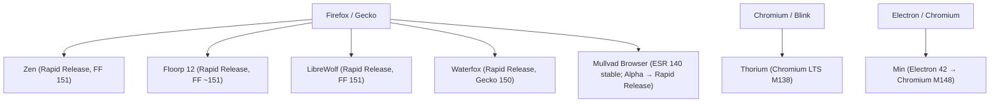

# Customization-Focused Browser Forks — Comparison Matrix (2026)

> **Slug**: `customization-browser-forks`
> **Date**: 2026-06-10
> **Scope**: Zen, Floorp, Waterfox, LibreWolf, Mullvad, Min, Thorium
> **Dimensions**: Engine base · Theming/Ricing · Privacy defaults · Update cadence · Core differentiators
> **Methodology**: Primary sources only (official changelogs, GitHub releases, official documentation). All claims traced to at least one source URL. Unverified claims marked ⚠️.

---

## Engine Lineage



---

## Summary Table

| Browser | Engine Base | Latest Version (Jun 2026) | Theming Depth | Privacy Stance | Update Cadence | Maintenance |
|---|---|---|---|---|---|---|
| **Zen** | Firefox/Gecko Rapid Release | 1.20.2b (FF 151.0.3) | ★★★★★ Deep | Moderate | ~Bi-weekly | Active |
| **Floorp** | Firefox/Gecko Rapid Release | 12.10.2 (FF ~151) | ★★★★★ Deep | Moderate | ~Monthly | Active |
| **LibreWolf** | Firefox/Gecko Rapid Release | 151.0.3-1 | ★★★☆☆ Medium | Hardened | ≤3 days after FF | Active |
| **Waterfox** | Firefox/Gecko Rapid Release | 6.6.12 (Gecko 150) | ★★★☆☆ Medium | Moderate | ~Monthly | Solo dev |
| **Mullvad** | Firefox/Gecko ESR 140 (stable) | 15.x stable / 16.0a7 alpha | ★☆☆☆☆ Anti-theming | Maximum | ESR cycle (~1yr major) | Active (Tor + Mullvad) |
| **Thorium** | Chromium LTS M138 | M138.0.7204.303 | ★★☆☆☆ Low | Minimal focus | ~Bi-annual (LTS) | Solo dev |
| **Min** | Electron/Chromium M148 | 1.35.5 | ★☆☆☆☆ Minimal | Light | Quarterly (maintenance) | Feature-frozen |

---

## Per-Browser Detail

### 1. Zen Browser

| Dimension | Claim | Evidence | Caveats | Confidence |
|---|---|---|---|---|
| **Engine** | Firefox/Gecko Rapid Release; FF 151.0.3 as of June 2026 | [GitHub Releases](https://github.com/zen-browser/desktop/releases) — "Updated to Firefox 151.0.3" in v1.20.2b | Tracks rapid release closely; not ESR | ✅ High |
| **Theming** | Multi-layer CSS architecture: per-workspace theming, CSS custom properties, SVG icon dynamic coloring, DOM structure modifications. First-party Mods ecosystem at zen-browser.app/mods. Boosts (v1.20+) for per-site CSS/JS injection. Built-in theme color picker. | [DeepWiki: UI Styling & Theming Architecture](https://deepwiki.com/zen-browser/desktop/5.3-ui-styling-and-theming-architecture); [Linuxiac: Boosts feature](https://linuxiac.com/zen-browser-1-20-adds-boosts-for-per-site-web-customization/) | userChrome also supported (inherits from Firefox); Mods are curated JS/CSS bundles | ✅ High |
| **Privacy defaults** | Privacy policy states no telemetry, no data collection. However, GitHub issue #10560 (opened Sep 2025, closed Sep 2025) confirmed a live connection to `incoming.telemetry.mozilla.org` on startup. ETP enabled but not hardened to LibreWolf level; no RFP by default. Issue #7000 calls for better transparency on outgoing connections. | [Zen Privacy Policy](https://zen-browser.app/privacy-policy/); [Issue #10560](https://github.com/zen-browser/desktop/issues/10560); [Issue #7000](https://github.com/zen-browser/desktop/issues/7000) | Telemetry issue was closed as resolved but exact resolution not confirmed in public changelog | ⚠️ Medium |
| **Update cadence** | Bi-weekly or faster; 1.19→1.20 major jump in early June 2026 | [GitHub Releases](https://github.com/zen-browser/desktop/releases) — multiple releases per month visible | Beta channel ships even faster | ✅ High |
| **Differentiators** | Arc-inspired sidebar-first UI, workspaces, compact mode, split-view (4-way grid), Glance (Alt+click floating preview), Container Tabs, Boosts for per-site customization | [SupaSidebar feature guide](https://supasidebar.com/blog/zen-browser-features-guide-2026) | New enough to still have rough edges; privacy posture weaker than LibreWolf/Mullvad | ✅ High |

---

### 2. Floorp

| Dimension | Claim | Evidence | Caveats | Confidence |
|---|---|---|---|---|
| **Engine** | Firefox/Gecko Rapid Release since Floorp 12 (migrated from ESR 128 which was EOL); current ~FF 151 | [Floorp 12 Upgrade FAQ](https://blog.floorp.app/en/notice/251027-floorp-12-upgrade-guide) — "Based on Rapid Release"; [Neowin 12.10.14 listing](https://www.neowin.net/software/floorp-12014/) | Prior versions (Floorp 11) were on ESR; migration to RR occurred Aug 2025 | ✅ High |
| **Theming** | Built-in theme switcher: Lepton, Photon, Proton, Firefox UI Fix, Fluerial. Full CSS injection, dual sidebars, multiple tab bar layout options, userChrome supported, Floorp Hub centralises all UI settings | [DeepWiki: UI Themes and Customization](https://deepwiki.com/Floorp-Projects/Floorp/5.3-ui-themes-and-customization); [floorp.app](https://floorp.app/) | Not every theme is as complete as first-party Firefox Proton; some options still in beta | ✅ High |
| **Privacy defaults** | No telemetry or user tracking per official docs. Built-in tracking protection. Not maximum-hardened — no RFP, no uBlock preinstalled by default; privacy is secondary to customization | [floorp.app](https://floorp.app/) — "no user tracking or data sharing, completely open source" | Less transparent about specific about:config hardening compared to LibreWolf; Japanese-language primary audience may affect community verification | ⚠️ Medium |
| **Update cadence** | ~Monthly, tracking Firefox Rapid Release. v12.10.2 per GitHub releases as of Jan 2026; active development | [GitHub Releases](https://github.com/Floorp-Projects/Floorp/releases) | Single-team project (Ablaze, Japan); bus factor applies | ✅ High |
| **Differentiators** | Strongest pure UI ricing of any Firefox fork: dual sidebars, workspaces, notes panel, mouse gestures, multiple layout presets, built-in tab management. Most customizable Firefox fork for power users who prioritize appearance | [Blue Fox comparison](https://www.bluefoxconsultant.com/en/blog/blue-fox-articles-2/comparison-of-some-firefox-forks-193); [LWN.net Firefox forks overview](https://lwn.net/Articles/1012453/) | Privacy hardening is limited; not a drop-in for LibreWolf users | ✅ High |

---

### 3. LibreWolf

| Dimension | Claim | Evidence | Caveats | Confidence |
|---|---|---|---|---|
| **Engine** | Firefox/Gecko Rapid Release; compiled from latest Firefox stable. Current: 151.0.3-1 | [Neowin: LibreWolf 151.0.3-1](https://www.neowin.net/software/librewolf-15103-1/); [Codeberg.org: LibreWolf](https://codeberg.org/librewolf) — updated 2026-06-03 | Not ESR-based; tracks stable Firefox directly | ✅ High |
| **Theming** | userChrome enabled via settings toggle (`librewolf-styling-checkbox` in preferences.ftl). No first-party theming beyond that; relies on user-authored CSS and addon themes. UI is vanilla Firefox with hardened defaults | [LibreWolf preferences.ftl (Fossies)](https://fossies.org/linux/librewolf/browser/preferences/preferences.ftl); [LibreWolf FAQ](https://librewolf.net/docs/faq/) | Theming not a design goal; some ricing possible via userChrome but not curated like Floorp/Zen | ✅ High |
| **Privacy defaults** | Maximum hardening out of box: telemetry fully off, Pocket removed at build time, ETP strict, uBlock Origin preinstalled, `privacy.resistFingerprinting` enabled, sponsored content disabled, no Mozilla accounts required | [LibreWolf.net](https://librewolf.net/); [SecureRank LibreWolf review 2026](https://securerank.info/reviews/browsers/librewolf/); [librewolf.cfg on GitLab](https://gitlab.com/librewolf-community/settings/blob/master/librewolf.cfg) | RFP may break some sites (canvas APIs, window.innerWidth spoofing); hardening creates compatibility cost | ✅ High |
| **Update cadence** | Within ≤3 days of Firefox stable, often same-day. Among the fastest upstream tracking of all forks listed | [LibreWolf FAQ](https://librewolf.net/docs/faq/) — "Updates usually come within three days from each upstream stable release, at times even the same day" | Community-maintained; may slow if maintainers unavailable | ✅ High |
| **Differentiators** | Pre-hardened Firefox with zero-config privacy. The only fork here that ships uBlock Origin by default. Hosted on Codeberg/GitLab (not GitHub), emphasizing independence from Microsoft. Best for users who want the LibreWolf.cfg hardening without manual setup | [LibreWolf.net](https://librewolf.net/); [asciijungle.com review 2026](https://asciijungle.com/posts/2026-02-19-browser-setup.html) | No unique UI features; theming minimal; some site breakage expected | ✅ High |

---

### 4. Waterfox

| Dimension | Claim | Evidence | Caveats | Confidence |
|---|---|---|---|---|
| **Engine** | Firefox/Gecko Rapid Release. Desktop 6.6.12 on Gecko ~149/150; Android 1.2.3 on Gecko 150 | [Waterfox releases](https://www.waterfox.com/releases/); [Android 1.2.3 release](https://www.waterfox.com/releases/android/1.2.3/); [Desktop 6.6.12 release](https://www.waterfox.com/releases/6.6.12/) | Sole developer (MrAlex); some delays due to integration complexity noted | ✅ High |
| **Theming** | userChrome supported and enabled by default. Toolbar customization. More personalization options added in 1.2.0. Known GTK theming regression in 6.6.x (toolbar color no longer from GTK system theme) | [Waterfox advanced customization docs](https://www.waterfox.com/support/waterfox-advanced-customization-and-configuration/); [GitHub issue #4128](https://github.com/BrowserWorks/waterfox/issues/4128) — open GTK color bug 2026-02-22 | GTK regression is unresolved as of late Feb 2026; userChrome edge cases reported | ⚠️ Medium |
| **Privacy defaults** | Privacy-focused but not maximally hardened. No AI features (explicitly: "we still don't have AI in the browser"). Native ad blocker (Brave's `adblock-rust`) in preview as of 6.6.11-12. Text ads allowed on Startpage (default search partner) for revenue. Startpage as default search. | [15 Years of Forking blog](https://www.waterfox.com/blog/15-years-of-forking/); [6.6.12 release notes](https://www.waterfox.com/releases/6.6.12/) | Allowing ads on default search partner is a commercial trade-off; less hardened than LibreWolf | ✅ High |
| **Update cadence** | Monthly cadence tracking Rapid Release. Desktop 6.6.12 (Apr 2026), Android Gecko 150 (Apr 2026). One month upgrade cycle with occasional delays when integration is complex | [Waterfox releases changelog](https://www.waterfox.com/releases/) | Solo-developer constraint; "some upstream changes proved more difficult than expected" per Android 1.2.3 notes | ✅ High |
| **Differentiators** | Oldest active Firefox fork (15 years). First fork to ship a process-level native ad blocker (faster than extension-based uBO). Anti-AI-in-browser stance as explicit product philosophy. ~1M monthly active users. BrowserWorks independent. | [15 Years of Forking blog](https://www.waterfox.com/blog/15-years-of-forking/) | Solo sustainability risk; revenue challenges acknowledged by developer | ✅ High |

---

### 5. Mullvad Browser

| Dimension | Claim | Evidence | Caveats | Confidence |
|---|---|---|---|---|
| **Engine** | Firefox/Gecko ESR 140 (stable). Alpha channel moved to Rapid Release (FF 150) in March 2026. Co-developed with Tor Project | [Mullvad blog: Alpha moves to Rapid Release](https://mullvad.net/en/blog/mullvad-browser-alpha-moves-to-firefox-rapid-release-and-adds-linux-arm-support); [GitHub releases](https://github.com/mullvad/mullvad-browser/releases) — stable on ESR, alpha on FF150/16.0a7 | Stable intentionally stays on ESR for longer-term testing; major version shipped annually (v14 = ESR128, v15 = ESR140) | ✅ High |
| **Theming** | Anti-theming by design: the entire fingerprint strategy depends on users being indistinguishable. `privacy.resistFingerprinting` on, letterboxing active, fonts restricted. `toolkit.legacyUserProfileCustomizations.stylesheets = true` is set (userChrome technically accessible), but customization undermines crowd-hiding. Dark theme has a known open bug (#271). Official stance: standardized configurations, users advised not to change settings | [Mullvad hard facts](https://mullvad.net/en/browser/hard-facts); [Techlore: how to customize without losing anonymity](https://discuss.techlore.tech/t/how-to-customize-mullvad-browser-without-sacrificing-anonymity/13643); [Dark theme issue #271](https://github.com/mullvad/mullvad-browser/issues/271) | Some customization possible without fingerprint impact (uBlock filter lists, some settings) but discouraged for core UI | ✅ High |
| **Privacy defaults** | Strongest anti-fingerprinting of all browsers here. Tor Browser's stack without Tor network: RFP on, letterboxing, all cookies cleared on close (private browsing permanent), no telemetry, font restriction, hardware API removal, canvas blocked, uniform user agent. Designed for Mullvad VPN + browser combination | [Mullvad hard facts](https://mullvad.net/en/browser/hard-facts); [How Mullvad Browser works](https://mullvad.net/en/browser/mullvad-browser); [SecureRank review 2026](https://securerank.info/reviews/browsers/mullvad-browser/) | Cookies clear on every close (no persistence option easily); some sites break under letterboxing; no sync | ✅ High |
| **Update cadence** | Stable: ESR-based, major version annually (ESR cycle ~1 year), security patches ~monthly. Alpha: now Rapid Release (4-week cadence). ESR transition audit performed annually | [Mullvad Browser 14.0 released (Nov 2024)](https://mullvad.net/en/blog/mullvad-browser-140-released); [GitHub releases](https://github.com/mullvad/mullvad-browser/releases) | Annual major version means 12+ month lag on new Firefox features in stable | ✅ High |
| **Differentiators** | Only browser here built for the "crowd-hiding" model: make every user look identical, not just harder to fingerprint. Collaboration with Tor Project. No account required, no crypto, no VPN built-in (VPN is separate Mullvad product). Free and open source. | [Mullvad browser landing page](https://mullvad.net/en/browser); [SecureRank review 2026](https://securerank.info/reviews/browsers/mullvad-browser/) | Weakest customization capability by design; not suitable as daily productivity driver for power users | ✅ High |

---

### 6. Min

| Dimension | Claim | Evidence | Caveats | Confidence |
|---|---|---|---|---|
| **Engine** | Electron (wraps Chromium). Latest: v1.35.5 (Apr 2026), built on Electron 42 → Chromium M148. Not a Chromium or Firefox fork — it's an Electron app | [GitHub releases](https://github.com/minbrowser/min); [Electron schedule](https://releases.electronjs.org/schedule) — M148 in Electron 42; [v1.35.3 release notes](https://github.com/minbrowser/min/releases/tag/v1.35.3) — "Upgraded Chromium to v144" | Electron adds ~100MB overhead; no native browser APIs like WebExtensions; sandboxing model differs from browsers | ✅ High |
| **Theming** | Minimal by design — no userChrome, no CSS injection into browser chrome. Userscripts (JS) can modify web content. Custom CRX-style themes via extensions. Tab fading, focus mode, layout tweaks only | [Min userscripts wiki](https://github.com/minbrowser/min/wiki/userscripts); [minbrowser.org](https://minbrowser.org/) | Ricing is not a use case; the browser's aesthetic is intentionally fixed/minimal | ✅ High |
| **Privacy defaults** | DuckDuckGo default search. Basic ad blocking built in. No telemetry by design (Electron telemetry status: ⚠️ uncertain — Electron may include Chromium metrics infrastructure). Privacy from simplicity rather than active hardening | [minbrowser.org](https://minbrowser.org/) | Electron's Chromium base may send some telemetry unless explicitly disabled; no published audit of outgoing connections | ⚠️ Low-Medium |
| **Update cadence** | Quarterly at best in 2026 (Jan, Mar, Apr releases). Maintainer publicly stated in Oct 2025: feature-frozen, security/Chromium upgrades only going forward | [Issue #2647: update on project](https://github.com/minbrowser/min/issues/2647) — "I will continue updating Min to new versions of Chromium and providing bug fixes… I don't plan to spend time working on new features" | Effectively in maintenance mode; no new features expected; long-term viability uncertain | ✅ High |
| **Differentiators** | Radical minimalism — the only browser here not derived from either Firefox or raw Chromium. JavaScript/HTML/CSS codebase makes it uniquely hackable. DuckDuckGo inline answers, focus mode, reader mode. Lowest UI surface area. ~9k GitHub stars despite age | [minbrowser.org](https://minbrowser.org/); [minbrowser/min repo](https://github.com/minbrowser/min) | Feature freeze, no WebExtensions support, no uBO, privacy unaudited | ✅ High |

---

### 7. Thorium

| Dimension | Claim | Evidence | Caveats | Confidence |
|---|---|---|---|---|
| **Engine** | Chromium LTS (not Chrome). Now intentionally tracking Chromium LTS only (~twice yearly) to reduce development burden. Current: M138.0.7204.303 (Feb 2026 Windows build). Not yet at M140+ | [Thorium.rocks](https://thorium.rocks/); [Issue #1067: M138 status tracker](https://github.com/Alex313031/thorium/issues/1067) — "Thorium will use the LTS Chromium versions from now on"; [newreleases.io M138 entry](https://newreleases.io/project/github/Alex313031/thorium/release/M138.0.7204.300) | LTS switch means ~6 month lag from latest Chromium stable; chosen explicitly for maintainability | ✅ High |
| **Theming** | Chrome extension themes (Chrome Web Store compatible). Thorium 2024 UI patch reverts Chrome Refresh 2023 (GM3) rounded corners and spacing to older, more compact GM2 style. Maintainer provides Thorium Material Dark theme and custom scrollbar CSS. No equivalent of userChrome | [TH24.md doc](https://github.com/Alex313031/thorium/blob/main/docs/TH24.md); [thorium-material-dark-theme repo](https://github.com/Alex313031/thorium-material-dark-theme); [Thorium-ScrollBars repo](https://github.com/Alex313031/Thorium-ScrollBars) | Theming limited to Chrome extension ecosystem; Qt theme system-theme non-compliance bug open (issue #1193, Apr 2026) | ✅ High |
| **Privacy defaults** | Some privacy/UI patches beyond vanilla Chromium per website. However: not ungoogled-chromium; Google service integrations likely present. ⚠️ No published privacy audit available. Performance is the explicit primary goal, not privacy. | [Thorium.rocks](https://thorium.rocks/) — "UI Changes and Patches for Linux and Windows that fix bugs, enhance useability, and strengthen privacy/security" (vague) | No documentation enumerating which Google APIs are removed/disabled vs. ungoogled-chromium; privacy claims unverified | ⚠️ Low |
| **Update cadence** | ~Bi-annual (LTS). Historical release gaps: 23–118 days per tracked issue. M138 LTS builds Feb 2026; next major post-M138 pending. Significant regression from earlier ~monthly cadence | [Issue #365: Time for an Update](https://github.com/Alex313031/Thorium-Win/issues/365) — historical gap data; [Issue #1067](https://github.com/Alex313031/thorium/issues/1067) confirms LTS strategy | Solo developer; LTS change was explicitly to relieve maintainability burden | ✅ High |
| **Differentiators** | Compiler-optimized Chromium: SSE4.2, AVX, AES, PGO, ThinLTO, LLVM loop optimizations. Claims 8–38% improvement over vanilla Chromium. Only performance-first fork in this list. Restores pre-GM3 UI. Niche audience: users who want maximum raw browser speed | [Thorium.rocks](https://thorium.rocks/) — "8-38% performance improvement over vanilla Chromium" | Performance claim not independently verified. Solo maintenance + LTS-only creates growing feature lag vs. upstream | ⚠️ Medium |

---

## Cross-Cutting Analysis

### Agreement Across Sources
- All 5 Gecko-based forks (Zen, Floorp, LibreWolf, Waterfox, Mullvad) track Firefox's engine — divergence is only in feature set, hardening, and update channel (ESR vs. Rapid Release).
- LibreWolf is consensus-best for privacy hardening at zero config cost; Mullvad is consensus-best for fingerprint resistance specifically.
- Floorp and Zen are the clear leaders on theming/ricing capability among all 7.
- Thorium and Min are outliers: neither Gecko-based, neither strongly privacy-focused.

### Disagreements / Tensions
| Claim | Status |
|---|---|
| Zen "no telemetry" (privacy policy) vs. confirmed `telemetry.mozilla.org` connection (GitHub #10560) | **Disagreement** — connection reported and issue closed, resolution unverified |
| Waterfox GTK theming "supported" vs. open regression bug #4128 (since 6.6.x) | **Disagreement** — feature exists but broken on GTK |
| Thorium privacy claims ("strengthen privacy/security") vs. no published audit | **Uncertain** — claim cannot be verified; treat as marketing without evidence |
| Mullvad "ESR-based" vs. Rapid Release Alpha shift | **In transition** — stable remains ESR; alpha is RR; strategy evolving |

### Uncertainty
- **Min's Electron telemetry status**: Chromium's metrics/crash reporting infrastructure is embedded in Electron. No published statement or audit on what Min specifically disables. Marked low confidence.
- **Thorium Google API status**: Thorium is not ungoogled-chromium. Whether Google Safe Browsing, Sync, and other services are present is not documented in public sources found.
- **Floorp privacy hardening depth**: Privacy described broadly on official site; no published equivalent of LibreWolf's `.cfg` file with specific prefs listed.

---

## Ricing Capability at a Glance

```
Floorp   ██████████ 10/10  Built-in themes, dual sidebar, layout presets, mouse gestures, workspaces
Zen      █████████░  9/10  Mods ecosystem, Boosts (per-site CSS), per-workspace color, split view
LibreWolf ████░░░░░░  4/10  userChrome accessible via toggle; no first-party theming system
Waterfox  ████░░░░░░  4/10  userChrome enabled; GTK regression open; limited first-party theming
Thorium   ███░░░░░░░  3/10  Chrome extension themes; TH24 UI patch; custom scrollbar CSS
Min       ██░░░░░░░░  2/10  Userscripts for web content; browser chrome fixed/minimal
Mullvad   █░░░░░░░░░  1/10  Theming actively discouraged; breaks crowd-hiding model
```
*Scale is subjective/ordinal, based on documented capabilities above.*

---

## Privacy Defaults at a Glance

```
Mullvad   ██████████ 10/10  Tor-stack fingerprinting resistance, letterboxing, fonts restricted, cookies clear on close
LibreWolf ████████░░  8/10  RFP on, uBO preinstalled, Pocket removed, ETP strict, no telemetry
Waterfox  █████░░░░░  5/10  No AI, native adblocker (preview), Startpage default, no hardened RFP
Floorp    ████░░░░░░  4/10  No tracking policy, built-in ETP, but not hardened
Zen       ████░░░░░░  4/10  No telemetry (claimed), Firefox ETP, but transparency gaps confirmed
Min       ███░░░░░░░  3/10  DDG default, basic adblocker, privacy by simplicity not hardening
Thorium   ██░░░░░░░░  2/10  Some patches beyond Chromium; no audit; performance-first
```
*Scale is subjective/ordinal. Not a security audit.*

---

## Update Cadence Comparison

| Browser | Channel | Approximate Cadence | Upstream Lag |
|---|---|---|---|
| LibreWolf | Rapid Release | ≤3 days after Firefox stable | Near-zero |
| Zen | Rapid Release | ~2 weeks | ~2 weeks |
| Floorp | Rapid Release | ~monthly | ~4 weeks |
| Waterfox | Rapid Release | ~monthly (with occasional delays) | ~4–6 weeks |
| Mullvad (stable) | ESR | Monthly security patches; major annually | 12+ months on features |
| Mullvad (alpha) | Rapid Release (new) | ~4 weeks | ~4 weeks |
| Min | Electron/Chromium | Quarterly (maintenance-only) | Varies; M148 vs Chrome M136 is ~2 versions |
| Thorium | Chromium LTS | ~Bi-annual | M138 = ~18+ months behind Chrome stable M136 |

---

## Recommended Use Cases (Derived from Evidence)

| Use Case | Best Fit | Reasoning |
|---|---|---|
| Maximum ricing / UI control | **Floorp** or **Zen** | Both have deep CSS systems, curated theme ecosystems |
| Privacy hardening, zero config | **LibreWolf** | uBO preinstalled, RFP on, ETP strict, tracks latest FF |
| Fingerprint resistance | **Mullvad** | Tor-stack crowd-hiding; only browser here with letterboxing + uniform fingerprint |
| Aether Browser reference for UI patterns | **Zen** + **Floorp** | Deepest documented CSS/theming architectures, most novel workspace/sidebar ideas |
| Performance (Chromium) | **Thorium** | Compiler-optimized LTS Chromium; tradeoff: long upstream lag, no verified privacy |
| Minimalist / maintenance-mode | **Min** | Feature-frozen, radical simplicity; not suitable for feature research |
| Privacy + no AI + lightweight independence | **Waterfox** | Anti-AI stance, native adblocker, independent; suitable for users who want Firefox-familiar |

---

## Aether-Specific Observations

Based on the comparison, these differentiators are **not covered by any single existing fork**:
1. **Deep theming + maximum privacy in one product** — Zen/Floorp have theming but weak privacy; LibreWolf/Mullvad have privacy but minimal theming. No fork combines both.
2. **Crowd-hiding fingerprinting + productive ricing** — Mullvad's model is fundamentally incompatible with theming. An architecture that sandboxes fingerprint surface from UI layer could be novel.
3. **Keyboard-first nav + workspace management** — Zen has workspaces; no fork has vim-like bindings baked in at the engine level.
4. **Native adblocker + hardened defaults** — Waterfox is exploring this (adblock-rust), LibreWolf still relies on the uBO extension. Native process-level blocking + RFP + no telemetry in one package doesn't exist yet.

---

## Sources

| # | Source | URL |
|---|---|---|
| 1 | Zen Browser GitHub Releases | https://github.com/zen-browser/desktop/releases |
| 2 | Zen Browser Privacy Policy | https://zen-browser.app/privacy-policy/ |
| 3 | Zen Browser: Telemetry connection issue #10560 | https://github.com/zen-browser/desktop/issues/10560 |
| 4 | Zen Browser: Transparency issue #7000 | https://github.com/zen-browser/desktop/issues/7000 |
| 5 | Zen UI Styling & Theming Architecture (DeepWiki) | https://deepwiki.com/zen-browser/desktop/5.3-ui-styling-and-theming-architecture |
| 6 | Zen Browser 1.20 Boosts feature (Linuxiac) | https://linuxiac.com/zen-browser-1-20-adds-boosts-for-per-site-web-customization/ |
| 7 | Zen Browser features guide 2026 (SupaSidebar) | https://supasidebar.com/blog/zen-browser-features-guide-2026 |
| 8 | Floorp Browser official site | https://floorp.app/ |
| 9 | Floorp 12 Upgrade FAQ | https://blog.floorp.app/en/notice/251027-floorp-12-upgrade-guide |
| 10 | Floorp UI Themes and Customization (DeepWiki) | https://deepwiki.com/Floorp-Projects/Floorp/5.3-ui-themes-and-customization |
| 11 | Floorp GitHub Releases | https://github.com/Floorp-Projects/Floorp/releases |
| 12 | Floorp v12.1.2 Release Notes | https://blog.floorp.app/en/release/12.1.2/ |
| 13 | LibreWolf official site | https://librewolf.net/ |
| 14 | LibreWolf FAQ | https://librewolf.net/docs/faq/ |
| 15 | librewolf.cfg (GitLab) | https://gitlab.com/librewolf-community/settings/blob/master/librewolf.cfg |
| 16 | LibreWolf on Codeberg | https://codeberg.org/librewolf |
| 17 | LibreWolf 151.0.3-1 (Neowin) | https://www.neowin.net/software/librewolf-15103-1/ |
| 18 | LibreWolf Review 2026 (SecureRank) | https://securerank.info/reviews/browsers/librewolf/ |
| 19 | LibreWolf preferences.ftl (Fossies) | https://fossies.org/linux/librewolf/browser/preferences/preferences.ftl |
| 20 | Waterfox Releases Changelog | https://www.waterfox.com/releases/ |
| 21 | Waterfox 15 Years of Forking blog | https://www.waterfox.com/blog/15-years-of-forking/ |
| 22 | Waterfox 6.6.12 release notes | https://www.waterfox.com/releases/6.6.12/ |
| 23 | Waterfox Android 1.2.3 Gecko 150 | https://www.waterfox.com/releases/android/1.2.3/ |
| 24 | Waterfox advanced customization docs | https://www.waterfox.com/support/waterfox-advanced-customization-and-configuration/ |
| 25 | Waterfox GTK theming regression issue #4128 | https://github.com/BrowserWorks/waterfox/issues/4128 |
| 26 | Mullvad Browser hard facts | https://mullvad.net/en/browser/hard-facts |
| 27 | How Mullvad Browser works | https://mullvad.net/en/browser/mullvad-browser |
| 28 | Mullvad Browser GitHub repo | https://github.com/mullvad/mullvad-browser?tab=readme-ov-file |
| 29 | Mullvad Browser official page | https://mullvad.net/en/browser |
| 30 | Mullvad Alpha → Rapid Release (blog) | https://mullvad.net/en/blog/mullvad-browser-alpha-moves-to-firefox-rapid-release-and-adds-linux-arm-support |
| 31 | Mullvad Browser 14.0 release | https://mullvad.net/en/blog/mullvad-browser-140-released |
| 32 | Mullvad Browser Review 2026 (SecureRank) | https://securerank.info/reviews/browsers/mullvad-browser/ |
| 33 | Mullvad dark theme issue #271 | https://github.com/mullvad/mullvad-browser/issues/271 |
| 34 | Mullvad customization without losing anonymity (Techlore) | https://discuss.techlore.tech/t/how-to-customize-mullvad-browser-without-sacrificing-anonymity/13643 |
| 35 | Min browser official site | https://minbrowser.org/ |
| 36 | Min browser GitHub repo | https://github.com/minbrowser/min |
| 37 | Min project update issue #2647 | https://github.com/minbrowser/min/issues/2647 |
| 38 | Min v1.35.5 release | https://github.com/minbrowser/min (latest release field) |
| 39 | Min v1.35.3 release notes | https://github.com/minbrowser/min/releases/tag/v1.35.3 |
| 40 | Min userscripts wiki | https://github.com/minbrowser/min/wiki/userscripts |
| 41 | Electron release schedule | https://releases.electronjs.org/schedule |
| 42 | Thorium Browser official site | https://thorium.rocks/ |
| 43 | Thorium M138 status tracker issue #1067 | https://github.com/Alex313031/thorium/issues/1067 |
| 44 | Thorium M138 release (newreleases.io) | https://newreleases.io/project/github/Alex313031/thorium/release/M138.0.7204.300 |
| 45 | Thorium Win M138 release | https://github.com/Alex313031/Thorium-Win/releases/tag/M138.0.7204.303/ |
| 46 | Thorium TH24 UI doc | https://github.com/Alex313031/thorium/blob/main/docs/TH24.md |
| 47 | Thorium Material Dark theme repo | https://github.com/Alex313031/thorium-material-dark-theme |
| 48 | Thorium Qt theme issue #1193 | https://github.com/Alex313031/thorium/issues/1193 |
| 49 | Thorium Win update cadence issue #365 | https://github.com/Alex313031/Thorium-Win/issues/365 |
| 50 | Blue Fox: Comparison of Firefox forks | https://www.bluefoxconsultant.com/en/blog/blue-fox-articles-2/comparison-of-some-firefox-forks-193 |
| 51 | LWN.net: A look at Firefox forks | https://lwn.net/Articles/1012453/ |
| 52 | asciijungle.com LibreWolf review 2026 | https://asciijungle.com/posts/2026-02-19-browser-setup.html |
