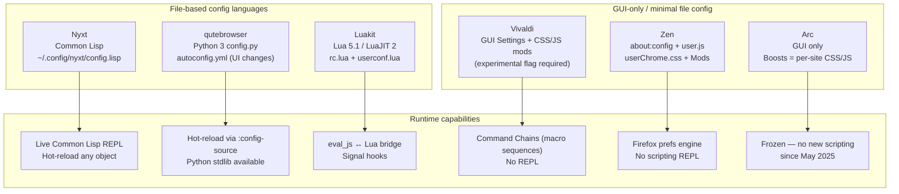

# Power-User Browser Comparison: Vivaldi · qutebrowser · Nyxt · Luakit · Arc · Zen

**Date**: 2026-06-10  
**Slug**: `power-user-browsers`  
**Dimensions**: Keyboard control · Customization depth · Workspace/spatial organization · Scripting & config model · Extensibility

---

## Maintenance Status (as of 2026-06-10)

| Browser | Engine | License | Status | Latest |
|---------|--------|---------|--------|--------|
| **Vivaldi** | Chromium | Proprietary (UI), BSD (engine) | ✅ Active | ~7.x |
| **qutebrowser** | QtWebEngine (Blink) | GPL-3.0 | ✅ Active (part-time, donation-funded) | v3.x |
| **Nyxt** | Multiple (WebKitGTK / WebEngine) | BSD-2-Clause | ✅ Active | 4.0.0 (Jan 2026) |
| **Luakit** | WebKit2GTK | GPLv3 | ⚠️ Low-activity | 2.4.0 (Feb 2025) |
| **Arc** | Chromium | Proprietary | 🔴 **Maintenance-only** since May 2025 | 1.146.0 (May 2026) |
| **Zen** | Firefox (Gecko) | MPL-2.0 | ✅ Active (beta) | 1.20.2b / Firefox 151 (Jun 2026) |

> **Arc critical note**: The Browser Company halted all feature development in May 2025, confirmed in the CEO's public letter and The Verge coverage. Arc now receives Chromium security updates only. The Browser Company has since been acquired by Atlassian and development effort has shifted to a new product (Dia). Arc is **not** recommended as a build target for new power-user features.

---

## Dimension 1 — Keyboard Control

### Matrix

| Browser | Modal / vi-like | Full Rebind | Command Palette | Macro/Chain | Platform caveat |
|---------|----------------|-------------|-----------------|-------------|-----------------|
| **Vivaldi** | ❌ No modal | ✅ GUI settings | ✅ Quick Commands | ✅ Command Chains (sequence macros) | macOS + Windows + Linux |
| **qutebrowser** | ✅ Full modal (normal/insert/hint/command/passthrough) | ✅ `config.py` + `:bind` | ✅ `:open` / command completion | ✅ `;;` chained commands | macOS + Windows + Linux |
| **Nyxt** | ✅ vi / emacs / CUA switchable per buffer | ✅ Lisp config | ✅ Prompt buffer | ✅ Lisp command composition | macOS + Linux (Windows: unsupported) |
| **Luakit** | ✅ Full modal (normal/insert/command) | ✅ `config/binds.lua` | ❌ No palette; `:` command mode | ✅ Lua macros | Linux only |
| **Arc** | ❌ No modal | ✅ GUI settings | ✅ Command bar (⌘T / Ctrl+T) | ❌ No macro chains | macOS + Windows only (no Linux, ever) |
| **Zen** | ⚠️ Partial (vim nav in urlbar only, PR #10518 merged Nov 2025) | ✅ GUI settings | ✅ Firefox awesomebar | ❌ None | macOS + Windows + Linux |

### Analysis

**Agreement**: All browsers allow rebinding. Vivaldi, Arc, and Zen provide GUI-based rebind without requiring file edits; qutebrowser, Nyxt, and Luakit require config file edits but give far more expressive control.

**Disagreement**: Modal browsing is the sharpest dividing line. qutebrowser, Nyxt, and Luakit are designed around modal keyboard-driven input from first principles. Vivaldi, Arc, and Zen are GUI browsers that accommodate keyboard shortcuts as a secondary affordance — no hint mode, no modal insertion, no passthrough mode.

**Uncertainty**: Nyxt 4.0 (Jan 2026) rebased its keybinding system; precise mode feature coverage against the released binary has not been independently verified here beyond documentation and ArchWiki sources.

---

## Dimension 2 — Customization Depth

### Matrix

| Browser | UI/Theme | CSS injection | Built-in extras | Config scope |
|---------|----------|--------------|-----------------|--------------|
| **Vivaldi** | ✅ Deep (colors, tab layout, toolbars, sidebar position, built-in themes) | ✅ Custom CSS via `vivaldi://experiments` flag; custom JS mods | ✅ Mail, RSS Feed Reader, Notes, Calendar, Translate, Screenshot | GUI-first + CSS/JS files |
| **qutebrowser** | ✅ Full color palette via `config.py`; pywal/base16 integration | ✅ `userContent.css` (page CSS); `userChrome` analog via settings | ❌ Minimal by design | Python config file |
| **Nyxt** | ✅ Everything: custom CSS per buffer class, color themes, layout | ✅ Per-buffer CSS, JS injection, mode-scoped | ✅ Programmable in Lisp — anything can be a "built-in" | Common Lisp config + REPL |
| **Luakit** | ✅ GTK system theme + custom CSS via `styles/` dir | ✅ Per-domain CSS injection | ❌ Minimal by design | Lua config files |
| **Arc** | ✅ Per-Space themes/colors | ✅ Boosts: per-site CSS + JS (still works; no new Boost features since 2025) | ✅ Side-by-side split (2 panes), Little Arc popup, Air Traffic Control | GUI only (no config file) |
| **Zen** | ✅ Themes, userChrome.css, Mods marketplace | ✅ `userContent.css`, Boosts (v1.20, per-site CSS/JS, Jun 2026) | ✅ Split view (4 tabs), Glance (peek panel), Compact Mode | Firefox prefs + CSS files |

### Analysis

**Agreement**: All six browsers allow per-site CSS injection (Boosts in Arc/Zen, styles in qutebrowser/Luakit/Nyxt, page-action CSS in Vivaldi).

**Disagreement**: Vivaldi has the widest **built-in toolset** of any GUI browser (mail, RSS, notes, calendar) — more comparable to an OS app platform than a browser. Nyxt has the deepest **programmatic** customization: any browser behavior is a Lisp object that can be redefined at runtime. Arc's customization surface is frozen — its Boost editor still works but receives no new capabilities.

**Caveat (Vivaldi CSS)**: Custom CSS requires enabling a flag at `vivaldi://experiments` first, then setting a folder in `Settings > Appearance > Custom UI Modifications`. This is not a documented stable API; it can break on major Vivaldi updates.

---

## Dimension 3 — Workspace & Spatial Organization

### Matrix

| Browser | Workspaces | Tab grouping | Vertical tabs | Split view | Sidebar | Visual tab overview |
|---------|-----------|--------------|--------------|------------|---------|---------------------|
| **Vivaldi** | ✅ Named workspaces (tabs isolated per workspace in same window) | ✅ Tab Stacks (2-level) | ✅ Native | ✅ Screen tiling / split screen | ✅ Panels (Notes, History, Bookmarks, Windows) | ✅ Windows Panel (tree view) |
| **qutebrowser** | ❌ Sessions only (`:session-save`) | ❌ None | ❌ None | ❌ None | ❌ None | ❌ None |
| **Nyxt** | ❌ No named workspaces (buffers are per-window only) | ❌ None formal | ❌ None | ❌ None (can script multi-window) | ❌ Buffers panel (basic) | ⚠️ `buffers-panel` (basic, UX improvement open issue #3702) |
| **Luakit** | ❌ None | ❌ None | ❌ None | ❌ None | ❌ None | ❌ None |
| **Arc** | ✅ Spaces (each has own pinned tabs, theme, icon; Favorites shared) | ✅ Folders in sidebar | ✅ Sidebar-first (vertical by default) | ✅ Split (2 panes) | ✅ Always-on sidebar | ✅ Tab switcher in sidebar |
| **Zen** | ✅ Workspaces + container tab integration (session isolation per workspace) | ✅ Container tabs | ✅ Sidebar-first | ✅ Split view (up to 4 tabs) | ✅ Sidebar | ✅ Compact Mode |

### Analysis

**Agreement**: Vivaldi, Arc, and Zen share a sidebar-first spatial metaphor with genuine workspace/space isolation. qutebrowser, Nyxt, and Luakit offer essentially **no** spatial organization primitives — they are single-context browsers that rely on the OS window manager for separation.

**Disagreement**: Zen and Arc Spaces are conceptually similar (sidebar, named containers, per-space context) but Zen integrates Firefox Multi-Account Containers for true cookie/session isolation per workspace — Arc Spaces do not isolate sessions.

**Uncertainty**: Nyxt's `buffers-panel` is described in open issue #3702 as needing major UX work (filed Dec 2025); per-buffer history trees are also planned but open (issue #3604). These are not shipped features as of Nyxt 4.0.0 (Jan 2026).

---

## Dimension 4 — Scripting & Configuration Model

### Diagram

### Matrix

| Browser | Config language | Hot-reload | REPL / interactive | Hooks / events | Per-domain config |
|---------|----------------|------------|-------------------|----------------|-------------------|
| **Vivaldi** | CSS + JS (experimental) | ⚠️ Restart required | ❌ None | ❌ None | ⚠️ Partial (page actions) |
| **qutebrowser** | Python 3 | ✅ `:config-source` | ❌ No REPL (use Python directly) | ❌ None native | ✅ URL pattern matching |
| **Nyxt** | Common Lisp | ✅ Full live reload | ✅ Built-in REPL | ✅ Hooks on all browser events | ✅ Per-buffer mode overrides |
| **Luakit** | Lua 5.1 / LuaJIT | ✅ Partial (`:lua` eval) | ⚠️ `:lua` command | ✅ Signal-based hooks | ✅ Per-domain Lua rules |
| **Arc** | None (GUI + Boosts) | N/A | ❌ None | ❌ None | ✅ Boosts are per-site |
| **Zen** | JS prefs / CSS | ⚠️ Restart often required | ❌ None | ❌ None (FF devtools only) | ✅ Boosts (v1.20) per site |

### Analysis

**Agreement**: All four file-based browsers (Vivaldi partially, qutebrowser, Nyxt, Luakit) support per-domain/per-URL configuration overrides.

**Disagreement**: Nyxt is categorically different — the browser IS a running Lisp image. Any object can be redefined without restarting. This is the Emacs model applied to a browser. qutebrowser and Luakit are programmable but require file edits; Arc and Zen are not programmable at all.

**Caveat (Vivaldi)**: The community-documented `vivaldi.*` API at `lonmcgregor.github.io/VivaldiModdersAPI` is reverse-engineered and unsupported — Vivaldi does not publish an official scripting API and can break mods on any update.

---

## Dimension 5 — Extensibility

### Matrix

| Browser | Extension ecosystem | Extension model | First-party plugins | Ecosystem health |
|---------|--------------------|-----------------|--------------------|-----------------|
| **Vivaldi** | ✅ Chrome Web Store (full CWS) | Chrome Extensions (MV2 + MV3) | ✅ Mail, RSS, Calendar, Notes, Translate built-in | ✅ Large |
| **qutebrowser** | ❌ **No WebExtensions** (QtWebEngine partial, not yet integrated) | Userscripts (FIFO, any language) + Greasemonkey scripts | ❌ Minimal | ⚠️ Small (userscripts community) |
| **Nyxt** | ❌ No WebExtensions | Common Lisp ASDF packages | ✅ Anything via Lisp | ⚠️ Very small (nx-search-engines, etc.) |
| **Luakit** | ❌ No WebExtensions | Lua modules | ❌ Minimal | ⚠️ Very small |
| **Arc** | ✅ Chrome Web Store (full CWS) | Chrome Extensions (MV2 + MV3) | ✅ Boosts, Little Arc, Air Traffic Control | ⚠️ Frozen (no new first-party) |
| **Zen** | ✅ Firefox AMO (full) | WebExtensions (Firefox model) | ✅ Mods marketplace, Boosts, Glance | ✅ Large (full Firefox ecosystem) |

### Analysis

**Agreement**: Vivaldi, Arc, and Zen inherit mature extension ecosystems (Chrome Web Store or Firefox AMO), making them immediately usable with thousands of existing extensions. qutebrowser, Nyxt, and Luakit trade ecosystem breadth for programmability depth.

**Disagreement**: qutebrowser's lack of WebExtensions is a known long-standing limitation (issue #30, open since 2014). The FAQ is explicit: "Support for WebExtensions is currently out-of-scope." Partial WebExtension API support landed in QtWebEngine 6.10 but has not been integrated into qutebrowser as of the 2025 changelog.

**Caveat (Arc)**: Arc cannot use Chrome Side Panel API extensions (e.g., Claude, Grammarly side panels) — a known gap that requires a community polyfill. This gap will not be fixed in maintenance mode.

---

## Summary Comparison Matrix

| | Vivaldi | qutebrowser | Nyxt | Luakit | Arc | Zen |
|---|---------|------------|------|--------|-----|-----|
| **Keyboard control depth** | ★★★☆☆ | ★★★★★ | ★★★★★ | ★★★★☆ | ★★☆☆☆ | ★★★☆☆ |
| **Customization depth** | ★★★★☆ | ★★★☆☆ | ★★★★★ | ★★★☆☆ | ★★☆☆☆ | ★★★★☆ |
| **Workspace / spatial org** | ★★★★★ | ★☆☆☆☆ | ★★☆☆☆ | ★☆☆☆☆ | ★★★★☆ | ★★★★☆ |
| **Scripting / config model** | ★★☆☆☆ | ★★★★☆ | ★★★★★ | ★★★★☆ | ★☆☆☆☆ | ★★☆☆☆ |
| **Extension ecosystem** | ★★★★★ | ★★☆☆☆ | ★★☆☆☆ | ★☆☆☆☆ | ★★★★☆ | ★★★★★ |
| **Active development** | ✅ | ✅ | ✅ | ⚠️ slow | 🔴 frozen | ✅ |
| **Linux support** | ✅ | ✅ | ✅ | ✅ Linux-only | ❌ Never | ✅ |

> Ratings are ordinal relative comparisons within this set, not absolute scores. ★★★★★ = best in class on this dimension among these six.

---

## Key Agreements

1. **Sidebar-first = better spatial browsing**: Vivaldi, Arc, and Zen converge on sidebar-first tab organization with named workspace isolation. This is a distinct architectural choice absent in the keyboard-centric trio.
2. **Per-site CSS injection is universal**: All six browsers support injecting custom CSS into pages, via different mechanisms (Boosts, userContent.css, styles/ dir, Lua, Lisp).
3. **No browser does everything**: The keyboard/programmability dimension and the spatial/ecosystem dimension are in strong tension. There is no browser in this set that is both fully modal-keyboard-driven AND has a mature extension ecosystem AND has workspace isolation.

## Key Disagreements

1. **WebExtensions vs. programmability**: qutebrowser, Nyxt, and Luakit explicitly trade extension ecosystems for scriptability depth. This is a deliberate design decision, not an oversight.
2. **Workspace isolation semantics**: Zen workspaces provide genuine Firefox container-based cookie/session isolation; Arc Spaces do not isolate sessions; Vivaldi Workspaces only group tab visibility.
3. **Arc's viability**: Arc ships a compelling spatial UX but is frozen. Using it as inspiration is appropriate; building on or recommending it to users is not.

## Key Uncertainties

1. **Nyxt 4.0 stability**: 4.0.0 was released Jan 2026 after ~2 years of development. Community sources (ArchWiki, GitHub discussions) describe it as capable but small-team and occasionally unstable. No independent benchmark of 4.0.0 rendering performance was found.
2. **qutebrowser WebExtension timeline**: QtWebEngine 6.10 partial WebExtension support was noted in the changelog but not yet integrated. It is unclear when or if qutebrowser will expose this. GitHub issue #30 is still open.
3. **Zen stability**: Still tagged "beta" as of June 2026. No stable release has shipped. The Boosts feature (v1.20) is recent (June 2026) and community feedback on reliability was not assessed here.
4. **Luakit maintenance trajectory**: 2.4.0 (Feb 2025) is the latest release. Commit history shows low activity. Whether development will accelerate or stall is unclear.

---

## Aether Relevance / Design Signals

For Aether's feature matrix, this comparison surfaces several clean signals:

- **Keyboard control**: The modal vim model (qutebrowser/Nyxt/Luakit) has a devoted power-user base with zero competitor (Arc, Zen, Vivaldi) implementing it natively. This is a clear gap.
- **Workspace isolation**: Zen's container-integrated workspaces (session + tab isolation per workspace) are uniquely useful and technically superior to Arc's cosmetic Spaces. Worth anchoring Aether's workspace design here.
- **Config model**: None of the GUI browsers (Vivaldi, Arc, Zen) expose a stable public scripting API. Luakit and qutebrowser show that a file-based scriptable config is the power-user default expectation. Nyxt is the ceiling.
- **Extension ecosystem**: Only Firefox (AMO, Zen) and Chrome (CWS, Vivaldi, Arc) ecosystems are mature. A new browser must either bridge one of these or accept a minimal extension surface at launch.

---

## Sources

All claims above are traceable to the following sources:

| # | Source | URL | Used for |
|---|--------|-----|----------|
| 1 | Vivaldi: Keyboard Shortcuts (official help) | https://help.vivaldi.com/desktop/shortcuts/keyboard-shortcuts/ | Vivaldi keyboard |
| 2 | Vivaldi: Command Chains (official help) | https://help.vivaldi.com/desktop/shortcuts/command-chains/ | Vivaldi macros |
| 3 | Vivaldi: Single Key Shortcuts | https://help.vivaldi.com/desktop/shortcuts/single-key-shortcuts/ | Vivaldi keyboard |
| 4 | Vivaldi: Custom CSS Tip #9 | https://vivaldi.com/blog/tips/tip-9/ | Vivaldi CSS mods |
| 5 | Vivaldi: Modding forum thread | https://forum.vivaldi.net/topic/10549/modding-vivaldi | Vivaldi CSS/JS mods |
| 6 | Vivaldi: Workspaces help | https://help.vivaldi.com/desktop/tabs/workspaces/ | Vivaldi workspaces |
| 7 | Vivaldi: Tab Stacks help | https://help.vivaldi.com/desktop/tabs/tab-stacks/ | Vivaldi tab groups |
| 8 | Vivaldi: Windows Panel help | https://help.vivaldi.com/desktop/tabs/window-panel/ | Vivaldi spatial |
| 9 | Vivaldi: Mail feature | https://vivaldi.com/features/mail/ | Vivaldi built-ins |
| 10 | Vivaldi: Community modder API | https://lonmcgregor.github.io/VivaldiModdersAPI/OfficialApi/everything.html | Vivaldi scripting |
| 11 | qutebrowser: Configuring docs | https://qutebrowser.org/doc/help/configuring.html | qutebrowser config |
| 12 | qutebrowser: FAQ | https://qutebrowser.org/doc/faq.html | qutebrowser no extensions |
| 13 | qutebrowser: Settings docs | https://qutebrowser.org/doc/help/settings.html | qutebrowser keybindings |
| 14 | qutebrowser: Userscripts docs | https://qutebrowser.org/doc/userscripts.html | qutebrowser extensibility |
| 15 | qutebrowser: CHANGELOG | https://qutebrowser.org/CHANGELOG.html | WebExtension status |
| 16 | qutebrowser: Extension issue #30 | https://github.com/qutebrowser/qutebrowser/issues/30 | No WebExtensions |
| 17 | qutebrowser: GitHub repo | https://github.com/qutebrowser/qutebrowser | Overview |
| 18 | Nyxt: Official documentation | https://nyxt.atlas.engineer/documentation | All Nyxt dimensions |
| 19 | Nyxt: Extensions tutorial | https://nyxt.atlas.engineer/article/nyxt-extensions-tutorial.org | Nyxt extensibility |
| 20 | Nyxt: Hooks article | https://nyxt.atlas.engineer/article/hooks.org | Nyxt hooks |
| 21 | Nyxt: Config philosophy | https://nyxt.atlas.engineer/article/class-based-functional-configuration.org | Nyxt config model |
| 22 | Nyxt: GitHub repo | https://github.com/atlas-engineer/nyxt | Overview |
| 23 | Nyxt: 4.0.0 release notes | https://github.com/atlas-engineer/nyxt/releases/tag/4.0.0 | Nyxt version/status |
| 24 | Nyxt: ArchWiki | https://wiki.archlinux.org/title/Nyxt | Nyxt keybindings |
| 25 | Nyxt: manual.lisp (keybinding section) | https://github.com/atlas-engineer/nyxt/blob/master/source/manual.lisp | Nyxt modes |
| 26 | Nyxt: LWN article | https://lwn.net/Articles/1001773/ | Nyxt buffers |
| 27 | Nyxt: buffers-panel issue #3702 | https://github.com/atlas-engineer/nyxt/issues/3702 | Nyxt workspace gaps |
| 28 | Nyxt: buffer history tree issue #3604 | https://github.com/atlas-engineer/nyxt/issues/3604 | Nyxt planned features |
| 29 | Luakit: Official site | https://luakit.github.io/ | Luakit overview |
| 30 | Luakit: Quick start guide | https://luakit.github.io/docs/pages/03-quick-start-guide.html | Luakit config |
| 31 | Luakit: Configuration docs | https://luakit.github.io/docs/pages/05-configuration.html | Luakit config model |
| 32 | Luakit: GitHub repo | https://github.com/luakit/luakit | Overview |
| 33 | Luakit: 2.4.0 release | https://github.com/luakit/luakit/releases/tag/2.4.0 | Luakit status/eval_js |
| 34 | Arc: Keyboard Shortcuts help | https://resources.arc.net/hc/en-us/articles/20595231349911-Keyboard-Shortcuts | Arc keyboard |
| 35 | Arc: Spaces help | https://resources.arc.net/hc/en-us/articles/19228064149143-Spaces-Distinct-Browsing-Areas | Arc spatial |
| 36 | Arc: Command bar actions | https://start.arc.net/command-bar-actions | Arc command palette |
| 37 | Arc: Letter to members (CEO) | https://browsercompany.substack.com/p/letter-to-arc-members-2025 | Arc maintenance mode |
| 38 | Arc: The Verge — development stopped | https://www.theverge.com/news/674603/arc-browser-development-stopped-dia-browser-company | Arc frozen |
| 39 | Arc: SupaSidebar status tracker | https://supasidebar.com/blog/arc-browser-status-tracker | Arc current state |
| 40 | Arc: Windows/Linux status 2026 | https://supasidebar.com/blog/arc-browser-windows-linux-status-2026 | Arc platform |
| 41 | Arc: Boosts for Chrome extensions | https://www.fromthekeyboard.com/using-arcs-boost-feature-to-make-chrome-extensions/ | Arc Boosts |
| 42 | Arc: Side panel polyfill (community) | https://github.com/Dhravya/arc-sidepanel-patch | Arc extension gap |
| 43 | Arc: macOS release notes 2024–2026 | https://resources.arc.net/hc/en-us/articles/20498293324823-Arc-for-macOS-2024-2026-Release-Notes | Arc updates |
| 44 | Zen: Release notes | https://zen-browser.app/release-notes/ | Zen version/status |
| 45 | Zen: Wikipedia | https://en.wikipedia.org/wiki/Zen_Browser | Zen overview |
| 46 | Zen: GitHub desktop releases | https://github.com/zen-browser/desktop/releases | Zen version |
| 47 | Zen: Keyboard shortcuts docs | https://docs.zen-browser.app/user-manual/shortcuts | Zen keyboard |
| 48 | Zen: Workspaces docs | https://docs.zen-browser.app/user-manual/workspaces | Zen workspaces |
| 49 | Zen: Boosts announcement | https://linuxiac.com/zen-browser-1-20-adds-boosts-for-per-site-web-customization/ | Zen Boosts |
| 50 | Zen: OMG Ubuntu overview | https://www.omgubuntu.co.uk/2025/08/zen-browser-is-what-mozilla-firefox-should-be | Zen overview |
| 51 | Zen: Vim urlbar PR #10518 | https://github.com/zen-browser/desktop/pull/10518 | Zen vim status |
| 52 | Zen: Split view docs (GitHub) | https://github.com/zen-browser/docs/blob/f46c5efa/content/docs/user-manual/split-view.mdx | Zen split view |
| 53 | Zen: DeepWiki keyboard shortcuts | https://deepwiki.com/zen-browser/desktop/3.7.3-keyboard-shortcuts | Zen keyboard system |
| 54 | Zen: DeepWiki workspace management | https://deepwiki.com/zen-browser/docs/3.3-workspace-management | Zen workspace isolation |
| 55 | HN: qutebrowser vs Nyxt discussion | https://github.com/qutebrowser/qutebrowser/discussions/8065 | Cross-browser user perspective |
| 56 | HN: qutebrowser/Nyxt/Luakit comment | https://news.ycombinator.com/item?id=41911468 | Community perspective |
| 57 | HN: Nyxt vs qutebrowser (SBCL speed) | https://news.ycombinator.com/item?id=42356235 | Community perspective |
