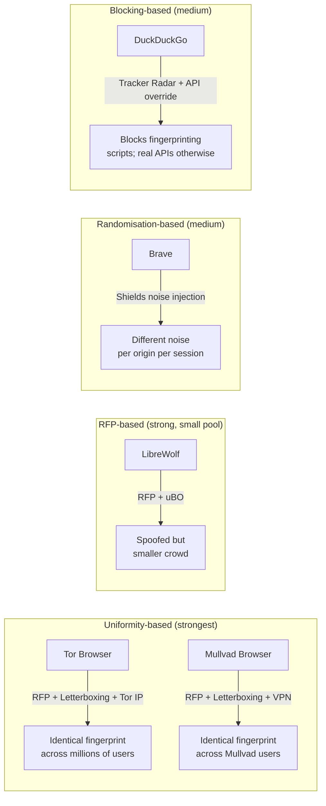

# Privacy Browsers 2026: Brave · LibreWolf · Mullvad Browser · Tor Browser · DuckDuckGo

**Date:** 2026-06-10  
**Slug:** `privacy-browsers-2026`  
**Sources:** privacytests.org automated test suite, Privacy Guides desktop browser recommendations, official browser privacy policies (Brave, DuckDuckGo), LibreWolf FAQ (v6.8), Tor Browser manual, Mullvad Browser docs (Privacy Guides), public MAU disclosures.

---

## Executive Summary

Five browsers dominate the privacy-focused desktop market in 2026. **Brave** is by far the largest at ~117M MAU, offering the best balance of blocking power and everyday usability on Chromium. **Mullvad Browser** and **Tor Browser** (both built on Firefox/Tor Project tech, version 14.5) offer the strongest anti-fingerprinting but serve niche audiences. **LibreWolf** is a power-user Firefox fork with RFP enabled and zero telemetry, traded against no auto-update. **DuckDuckGo Browser** is the most accessible entrant with a proprietary Tracker Radar engine and novel protections (CNAME cloaking, GPC, link parameter stripping) but weaker active fingerprinting resistance.

No browser is perfect: Brave's Safe Browsing leaks IP on Android; DuckDuckGo explicitly exempts `bat.bing.com` on ad clicks; LibreWolf has no auto-update; Mullvad/Tor Browser sacrifice usability for fingerprint uniformity; Tor is the only one masking IP by default.

---

## Comparison Matrix

### 1. Blocking Engine

| Browser | Engine / Mechanism | Default Lists | Custom Lists | Notes |
|---|---|---|---|---|
| **Brave** | Shields (Brave-built, Chromium-native) | Brave's own lists (Easylist-derived + custom) | Yes — `brave://adblock`, extra lists supported | "Aggressive" mode blocks first-party trackers too; JavaScript disable per-site available |
| **LibreWolf** | uBlock Origin (bundled, aggressive default) + Firefox ETP Strict | uBO default filter sets + ETP blocklists | Yes — via uBO | ETP Strict adds dFPI, SmartBlock, cookie cleaning, URL query stripping |
| **Mullvad Browser** | uBlock Origin (pre-installed, default settings) + NoScript + ETP Strict | Same as LibreWolf | **No** — modifying uBO or NoScript changes your fingerprint | Strict mode mandatory; altering defaults breaks fingerprint uniformity |
| **Tor Browser** | NoScript + ETP; limited uBlock-style filtering | NoScript default allowlist | **No** — same reason as Mullvad | JavaScript blocked at "Safest" level; at "Standard" most scripts run |
| **DuckDuckGo** | Proprietary Tracker Radar (open-source list) — blocks tracker *loading* (not post-load) | DDG's own Tracker Radar + CNAME list | No — managed by DDG | Includes CNAME cloaking detection, link param stripping, GPC, surrogate scripts, social media embedding blocks (FB) |

**Observation:** DuckDuckGo's approach of blocking tracker *loading* (pre-fetch) is architecturally different and stronger than cookie-only post-load blocking. Brave and LibreWolf/Mullvad both combine list-based blocking with state-partitioning. Tor/Mullvad intentionally avoid heavy custom list use to preserve fingerprint uniformity.

**Agreement:** All five block common third-party trackers by default.  
**Disagreement:** DDG and Brave have commercial ad exceptions (DDG/Microsoft `bat.bing.com`; Brave BAT-related features). Tor/Mullvad resist customization for uniformity; others embrace it.

---

### 2. Anti-Fingerprinting

| Browser | Technique | Canvas | WebGL | Fonts | User-Agent | Window Size | Timezone/Locale | Level |
|---|---|---|---|---|---|---|---|---|
| **Brave** | Randomisation (per-session, per-origin nonce) | Noise injection | Noise injection | Enumeration blocked | Chromium UA (not spoofed to generic) | Real size (no rounding) | Real | **Medium-High** — randomization, not uniformity |
| **LibreWolf** | RFP (Resist Fingerprinting) — Tor Uplift Project | Prompt per site (blocked by default) | Blocked by default | Enumeration reduced | Firefox ESR spoofed to generic Windows Firefox | Rounded to nearest 200×100 | Spoofed to UTC / en-US | **High** — but no crowd (small user base) |
| **Mullvad Browser** | Full Tor Browser anti-fingerprinting (RFP + letterboxing) | Blocked/prompted | Blocked at Safer/Safest | Homogenized | Identical to all Mullvad Browser users | Letterboxed | Spoofed en-US/UTC | **Very High** — fingerprint matches entire Mullvad user pool |
| **Tor Browser** | Full Tor Browser anti-fingerprinting + Tor network IP masking | Blocked/prompted | Blocked at Safest | Homogenized | Identical to all Tor Browser users | Letterboxed | Spoofed en-US/UTC | **Highest** — IP masked, uniform fingerprint across millions |
| **DuckDuckGo** | API override (blocks known fingerprinting scripts) | Fingerprinting scripts blocked before load | Fingerprinting scripts blocked | Enumeration blocked via script interception | Varies by platform/OS | Real | Real | **Medium** — stops known trackers but does not actively spoof most vectors |

**Observation:** Mullvad and Tor provide *uniformity*-based protection (blend into crowd), which is categorically stronger than randomisation. Brave's randomisation prevents *replay* attacks but not *same-session* fingerprinting by multiple domains. LibreWolf's RFP is powerful but the small user base reduces the anonymity-set benefit.

**Source:** privacytests.org state-partitioning suite (fetched 2026-06-10) confirmed Brave, LibreWolf, Mullvad, Tor, and DuckDuckGo all *pass* alt-svc, CacheStorage, blob, BroadcastChannel, CSS cache, fetch cache, indexedDB, localStorage, and other cross-site partitioning tests. DuckDuckGo fails the *blob URL* cross-site test (blob URLs accessible cross-first-party). LibreWolf and DuckDuckGo both *fail* HSTS cache partitioning.

---

### 3. Telemetry Stance

| Browser | What Is Collected | Opt-In vs Opt-Out | Update Pings | Crash Reports | Evidence |
|---|---|---|---|---|---|
| **Brave** | P3A: aggregate anonymous product analytics (no PII, no browsing history); crash reports; update counts (aggregate only). Safe Browsing: partial URL hashes sent to Google (proxied on desktop, **not** proxied on Android). | P3A: **opt-out** (enabled by default, can disable in Settings); crash reports: opt-out | Yes — anonymous count only, no identifiers | Opt-out; stored ≤1 year | Brave Privacy Policy (brave.com/privacy/browser) |
| **LibreWolf** | **None** — all Mozilla telemetry stripped at build time; no Normandy, no Studies, no usage pings | N/A | No automated update pings (manual update only) | None sent | LibreWolf FAQ: "Does LibreWolf make any outgoing connections?" — only security-related connections (CRLite, ETP lists, uBO lists, GPU blocklist) |
| **Mullvad Browser** | **None** — Tor Project/Mullvad policy explicitly disables all telemetry | N/A | Minor: update check to Mullvad/Tor CDN | None sent | Privacy Guides: "Mullvad Browser similarly removes all telemetry" |
| **Tor Browser** | **None** — Tor Project policy; no logging of any kind | N/A | Update checks via Tor network | None sent | Tor Project policy; traffic is onion-routed so even update IPs are masked |
| **DuckDuckGo** | "Never tracks you" per policy; anonymous aggregate analytics claimed but details sparse; Fire Button clears local data on demand | Default behavior (no disclosed opt-out for aggregate analytics) | Update checks (no browsing data) | None explicitly disclosed | DuckDuckGo Web Tracking Protections page; DDG privacy policy |

**Uncertainty:** DuckDuckGo's precise telemetry scope is less publicly audited than Brave's (which publishes P3A questions on GitHub). LibreWolf and Mullvad have the most transparent zero-telemetry posture.

---

### 4. Default Search Engine & Monetization

| Browser | Default Search | Revenue Model | Third-Party Ad Involvement | Transparency |
|---|---|---|---|---|
| **Brave** | **Brave Search** (own independent index) | BAT token ecosystem (opt-in user ads → BAT rewards); Brave Search ads; Premium subscriptions (Leo AI, Search Premium, VPN) | Brave proxies its own ads; **not** Google/Facebook. Brave Search has own index. | High — detailed privacy policy, P3A open-source, BAT audit trail |
| **LibreWolf** | **DuckDuckGo** (default, user-changeable) | **None** — no commercial model; volunteer project | None | N/A — no funding, no ads |
| **Mullvad Browser** | **DuckDuckGo** | Mullvad VPN subscription (€5/mo); browser is free tool to complement VPN | None in browser | Clear — Mullvad privacy policy, Tor Project co-developer |
| **Tor Browser** | **DuckDuckGo** (also has DuckDuckGo .onion version) | Tor Project grants, donations | None | Very high — 501(c)(3) nonprofit, annual reports |
| **DuckDuckGo** | **DuckDuckGo** | Search advertising via **Microsoft Bing partnership** — Microsoft Advertising shows ads on DDG search. Microsoft commits not to profile DDG users. **Exception:** `bat.bing.com` loads after DDG ad clicks on advertiser sites (3rd-party tracker loading protection suspended for this case) | Microsoft Advertising (Bing); Microsoft does not profile DDG users per published commitment | Published exception detailed on DDG Web Tracking Protections page |

**Disagreement:** DuckDuckGo's Microsoft Bing ad dependency is a structural conflict-of-interest that the browser itself acknowledges with an explicit exception in its tracker-loading protection. Brave monetizes via its own BAT/ad ecosystem without Google dependence. LibreWolf and Tor are entirely non-commercial.

---

### 5. User Base

| Browser | Estimated Users (2026) | Growth Trend | Primary Demographic | Source |
|---|---|---|---|---|
| **Brave** | **117.56M MAU** (May 2026); **48.98M DAU** | +3.1% MAU MoM; 100% Linux YoY growth; record pace since Google AI changes | Power users, crypto users, privacy mainstream crossover | Brendan Eich public tweet Jun 2026; brave.com/transparency; piunikaweb.com Jun 2026 |
| **LibreWolf** | **Unknown — no published stats** | Stable/growing niche; no commercial incentive to measure | Advanced Linux/technical users; privacy enthusiasts; Arkenfox-adjacent community | LibreWolf FAQ: "We don't want to deal with administration" — no donation tracking |
| **Mullvad Browser** | **Unknown — no published stats** | Growing since 2023 launch; niche VPN-adjacent audience | Mullvad VPN customers; high-threat-model users | No public disclosure; Mullvad does not publish browser-specific MAU |
| **Tor Browser** | **~2M daily users** (estimated from relay data) | Stable with spikes during political events | Journalists, activists, high-risk users, anonymity seekers | Tor Project relay-based estimation; Tor Metrics portal (metrics.torproject.org) |
| **DuckDuckGo** | Search: ~100M monthly users; Browser: **+76% US install jump** reported Jun 2026 | Accelerating — Google AI Search Overhaul driving migration | Privacy-conscious mainstream users, Google search migrants | piunikaweb.com Jun 2026; DDG does not separately publish browser MAU |

**Caveat:** LibreWolf, Mullvad, and DuckDuckGo desktop browser MAU are either unreported or not separately disclosed from extension/search usage. Brave is the only subject with auditable, CEO-published MAU figures.

---

## Architecture Comparison (Anti-Fingerprinting Pipeline)

---

## Agreement, Disagreement, and Uncertainty

### Agreement (all five browsers)
- All block common third-party trackers by default.
- All enforce or strongly promote HTTPS.
- All support or default to DuckDuckGo or privacy-respecting search.
- All pass the core privacytests.org state-partitioning test suite (cross-site cookie, cache, localStorage isolation).
- None collect browsing history or sell user data.

### Disagreement
| Issue | Brave | LibreWolf | Mullvad | Tor | DuckDuckGo |
|---|---|---|---|---|---|
| Anti-fingerprinting depth | Randomization | RFP (strong) | RFP + uniformity | RFP + uniformity + IP mask | Block-then-override |
| Telemetry by default | P3A (opt-out) | Zero | Zero | Zero | Unspecified aggregate |
| Auto-update | ✅ | ❌ (manual) | ✅ | ✅ | ✅ |
| Commercial ad deal | BAT ecosystem | None | None | None | Microsoft Bing exception |
| User base | 117M MAU | Unknown (small) | Unknown (small) | ~2M DAU | Unknown (large) |
| IP address masked | No | No | No | **Yes** | No |

### Uncertainty / Gaps
- **DuckDuckGo** has no published, audited telemetry report comparable to Brave's P3A GitHub list. The aggregate analytics they claim are not independently verifiable.
- **LibreWolf and Mullvad** user base is genuinely unknown; neither project publishes download counts or MAU.
- **Tor Browser** circuit isolation provides stream isolation per site on desktop, but this degrades performance significantly. Not independently auditable in the browser binary.
- **Brave** Safe Browsing on **Android** sends partial URL hashes to Google without IP proxying — acknowledged in privacy policy. Desktop proxies this.
- privacytests.org **ServiceWorker** tests produced failures/errors for multiple browsers including LibreWolf and Mullvad in the June 2026 test run, likely due to test infrastructure rather than browser defect — treat those results as **inconclusive**.

---

## Open Questions

1. Does DuckDuckGo conduct internal usage analytics it does not disclose? Their privacy policy for search is detailed but the browser-specific telemetry scope is thin.
2. As Brave grows past 100M MAU, does its BAT ecosystem generate sufficient revenue to remain independent from Google referral fees? (Brave's default search *used* to be Google; it switched to its own engine in 2022.)
3. Will LibreWolf's lack of auto-update become a critical security liability as the number of users on stale Firefox versions grows?
4. With Mullvad Browser at version 14.5 and Firefox ESR lag, how long does security patch latency run behind upstream? Privacy Guides noted this as a concern.
5. Can DuckDuckGo's Tracker Radar listing scale to cover the CNAME-cloaking long tail at the same pace trackers evolve?

---

## Recommended Use Cases

| Use Case | Recommended Browser | Rationale |
|---|---|---|
| Everyday private browsing, mainstream user | **Brave** | 117M user base, Chromium compatibility, balanced blocking/usability, own search engine |
| Developer/power user, max control | **LibreWolf** | RFP + uBO, zero telemetry, fully configurable; accept manual updates |
| VPN user wanting fingerprint uniformity | **Mullvad Browser** | Designed for VPN+browser pairing; best non-Tor fingerprint crowd |
| High-threat-model (journalist, activist) | **Tor Browser** | Only option masking IP by default; stream isolation; largest anonymity set |
| Privacy-mainstream crossover, easy setup | **DuckDuckGo** | Fire Button, cookie consent automation, GPC, CNAME protection; lower learning curve |

---

## Sources

| # | Source | URL | Evidence Type |
|---|---|---|---|
| 1 | privacytests.org — Browser Privacy Test Results | https://privacytests.org | Automated benchmark (fetched 2026-06-10) |
| 2 | Privacy Guides — Desktop Browsers | https://www.privacyguides.org/en/desktop-browsers/ | Community-reviewed recommendation page |
| 3 | Brave Browser Privacy Policy | https://brave.com/privacy/browser/ | Official privacy policy |
| 4 | Brave Transparency Data Feed | https://brave.com/transparency/ | Official MAU/DAU metrics |
| 5 | Brave 117.56M MAU (May 2026) | https://piunikaweb.com/2026/06/03/brave-duckduckgo-growth-google-ai-changes/ | News coverage, citing CEO Eich tweet |
| 6 | Brave 115M MAU (April 2026) | https://cyberinsider.com/brave-sees-100-linux-growth-as-browser-reaches-115m-monthly-users/ | News coverage with metrics |
| 7 | LibreWolf FAQ (v6.8) | https://librewolf.net/docs/faq/ | Official documentation |
| 8 | DuckDuckGo Web Tracking Protections | https://help.duckduckgo.com/privacy/web-tracking-protections | Official documentation |
| 9 | DuckDuckGo Privacy Configuration (GitHub) | https://github.com/duckduckgo/privacy-configuration | Open-source configuration |
| 10 | DuckDuckGo Tracker Blocklists | https://github.com/duckduckgo/tracker-blocklists | Open-source blocklist |
| 11 | Privacy Guides Forum — Mullvad vs LibreWolf | https://discuss.privacyguides.net/t/what-is-the-difference-between-mullvad-browser-and-librewolf/36214 | Community analysis |
| 12 | Privacy Guides Forum — Firefox+Arkenfox vs Mullvad | https://discuss.privacyguides.net/t/firefox-arkenfox-instead-of-mullvadbrowser/33024 | Community analysis |
| 13 | securetoolsguide.com — Privacy Browser Comparison 2026 | https://securetoolsguide.com/privacy-browser-comparison-2026/ | Third-party comparison |
| 14 | Tor Browser Manual — About Tor | https://tb-manual.torproject.org/about/ | Official documentation |
| 15 | Brave Blog — 100M MAU milestone | https://brave.com/blog/100m-mau/ | Official blog post |
| 16 | sebastiangogola.me — Comparing LibreWolf, Mullvad, Brave 2025 | https://sebastiangogola.me/the-most-private-browsers-in-2025-comparing-librewolf-mullvad-brave-more/ | Independent blog analysis |
| 17 | backlit.neocities.org — Browser Evaluation: Mullvad vs Floorp vs LibreWolf | https://backlit.neocities.org/browser-evaluation-mullvad-floorp-librewolf | Independent browser evaluation |

---

*All claims marked [UNVERIFIED] or speculative in the text above are based on incomplete data. Quantitative test results are from privacytests.org as of the date of fetch. User-base figures for LibreWolf, Mullvad Browser, and DuckDuckGo Desktop are not independently verifiable from primary sources as of 2026-06-10.*
